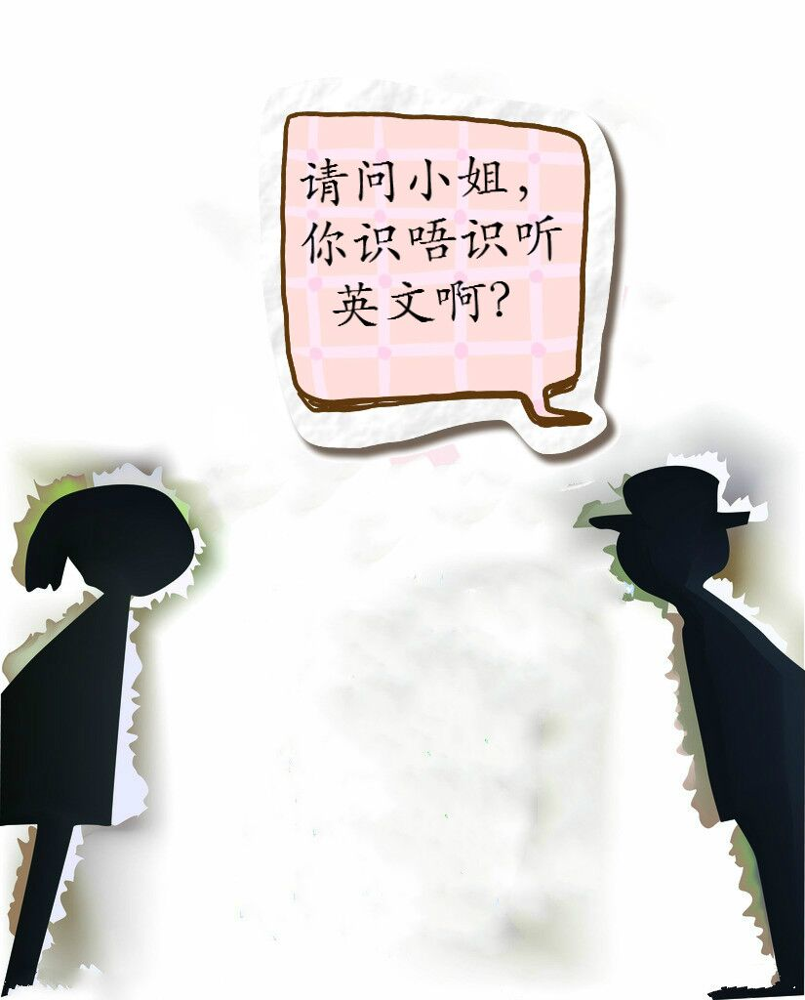
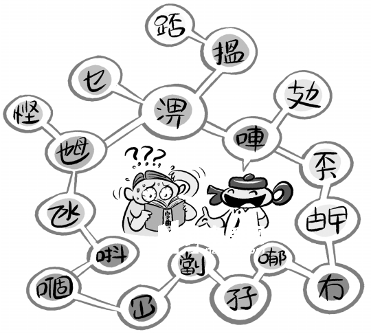
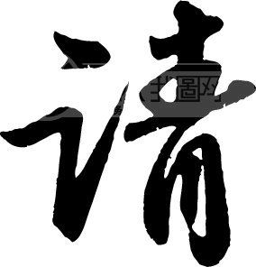

#Lesson01

---

#This is Unit 1 of Pimsleurs Cantonese One.
##Listen to this conversation.

---

#“请问小姐，你识唔识听英文啊？”

---

#“唔识听，我唔识听英文。”

---

#“我识听你听广东话”

---

#“你系唔系美国人呢？”

---

#“是，我系美国人.”

---

##“In the next few minutes,you will learn not only to understand this conversation, but to take a part it yourself.”

---

##“Imagining an American meeting a cantonese woman, you want to begin a conversation,so he says···‘Excuse me?’”

---

# “请问?”

---

##“The Cantonese speaker is going to repeat this word,part by part,starting for the end.”

---

##“You are to repeat each part after him.Try to make your pronounciation  exactly sound likes his.”

---

##“Be sure to repeat aloud.”

---

#“问···问···”

---

#“请···请···”

---

#“请问”

---
#made by
#官雨婷、祁亚蓉

