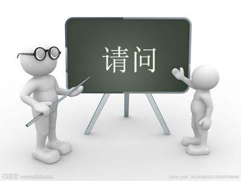

#**粤语吧**

欢迎加入粤语吧！本课程主要为广大粤语爱好者提供一个自主学习的平台。祝同学们早日学有所成~

##现在进入粤语学习的第一单元,请听下面的一段对话！

---

##请问小姐，你识唔识听英文啊？

--

##唔识听。我唔识听英文。

--

##我识听一滴广东话。

--

##你系唔系美国人啊？

--

##系，我系美国人。

---

##在接下来的时间中，你将不仅仅去理解对话意思，更要自己放声练习。请想象一位美国男士遇到一位广东女士。他打算发起一段对话，所以他说：Excuse me（请问）.
##请问......

--

##对话中将会用粤语将句子分成词语重复诵读。请大声地跟读，尝试尽量使发音和领读者相似。

--

##问......问......

--

##请......请......

--

##请问

---

##“Excuse me（请问）”用粤语怎么说？

--

##请问......

---

##现在，美国男士想要问女士是否听得懂英语。这部分涉及到“英语”用粤语怎么说。请认真听并重复练习。

--

##英文......

--

##文......文......

--

##英......英......

--

##英文

---

##“English(英语)”用粤语怎么说？

--

##英文......英文......

---

##请用粤语说“Excuse me (请问)”

--

##请问

---

##请你跟读领读者的正确发音，尽量使得你的发音和领读者的相同。

--

##请问

