#粤语学习课件
##第一单元 - 第01课

---

请听对话

---

#对话

---

#听 · 理解 · 参与

---

#想象情境

---

#“请问”

---

这位说广东话的人将会一部分一部分的重复，从开始到结束。你需要做的就是跟着他重复每个部分，尽量让你的发音和他的发音完全一样，并尽量大声朗读。

---

问

问

请

请

请问

---

你应该怎么用粤语说请问

---

请问

---

现在这位男士想问这位女士，她是否能够听得懂武汉话，武汉话这个词是这样说的。请聆听，并跟读。

---

武汉话

武

武

汉

汉

话

话

武汉话

---

武汉话怎么说？

---

---

请问

---

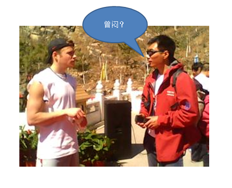

---

---

##请问

---

###请听导语。。。

---

##武汉话

---

###请听导语。。。

---

##能  能
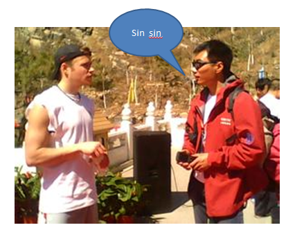

---

#请听导引

---

#听。。。。。。听

---

---

#请听导引

---

---

---

---

---

---

---

---

---

---

---

---

##你会听武汉话

---

##现在是教你如何说“听不懂”，请聆听并跟读。

---

##"不会听，不，不会，不会听"

---

##你有听出在开始的时候，他的语气是如何先降低，然后再升起来的吗？再说一遍：“听不懂。”

---

##"不会听，不会听。"

---

##降低的声调是为了表达否定的意思，现在，我们两句话一起说一遍：“听得懂，听不懂。”

---

##识听（听得懂）

---

##唔识听（听不懂）

---

##识（懂）

---

##唔识（不懂）

---

---

##你唔识听

---

##你唔识听

---

---

##你识唔识听啊？你识唔识听啊？

---

---

##你识唔识听啊？

---

##啊？ 啊？

---

##识唔识？（懂不懂？）
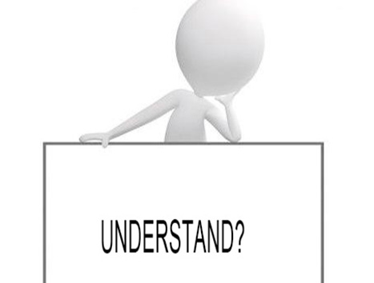

---

##你识唔识听啊？（你听不听得懂？）

---

##在句末的“啊”这个发音是为了让你的提问听起来更礼貌一些.现在问我是否能够听得懂...

---

##你识唔识听啊？
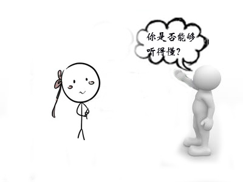

---

##哪一部分的意思是听不懂？

---

##唔识听

---

##你的发音是否先降下，然后又升起来了呢
##再说一遍“你听不懂”

---

##我唔识听

---

##说 “请问”

---

##请问

---

##“请问小姐”聆听并跟读

---
 
##请问小姐...小姐...姐...小姐...小姐

---

##指导语##

---

---

##指导语##

---

---

##指导语##

---

---

##指导语##

---

---

##指导语##

---

---

##指导语##

---

---

---

##你听不听得懂

---

##听不懂,听不懂

---

##我、我、我

---

##我、我

---

##我识听

---

##我识听武汉话

---

##你识听

---

##请问小姐

---

##你识唔识听武汉话啊

---

##唔识听

---

---

#我听不懂

---

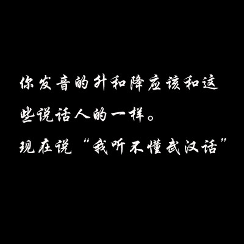

---

##我听不懂武汉话

---

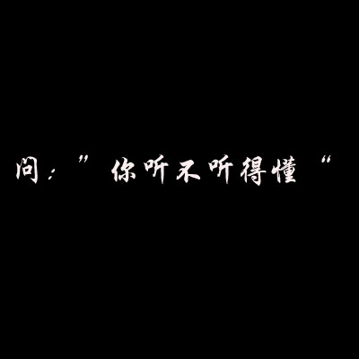

---

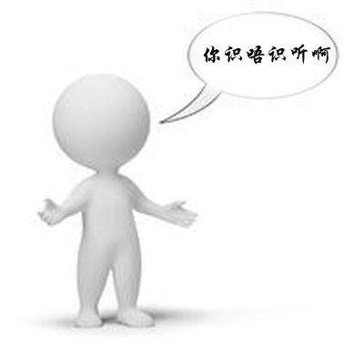
##你听不听得懂

---

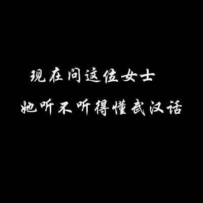

---

##你听不听得懂武汉话啊？

---

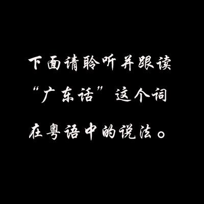

---

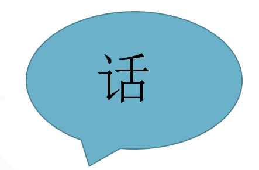

---

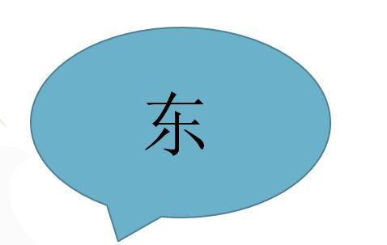

---

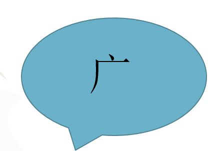

---

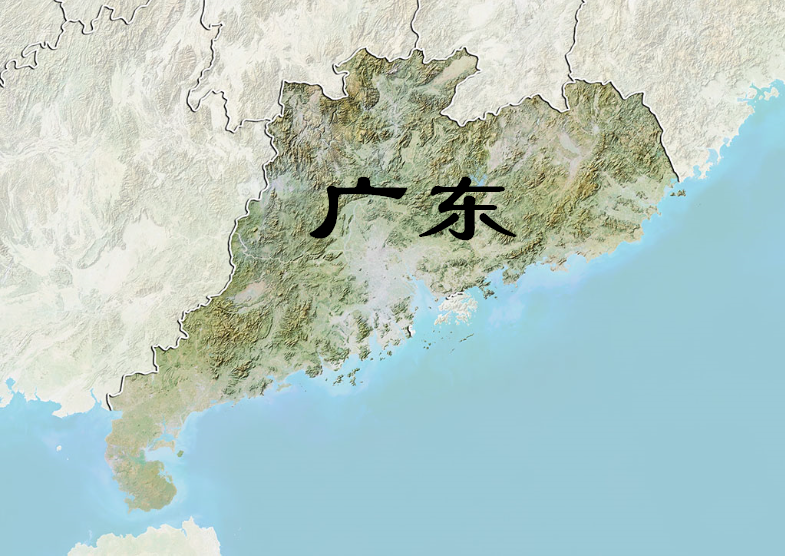

---

---

---

---

---

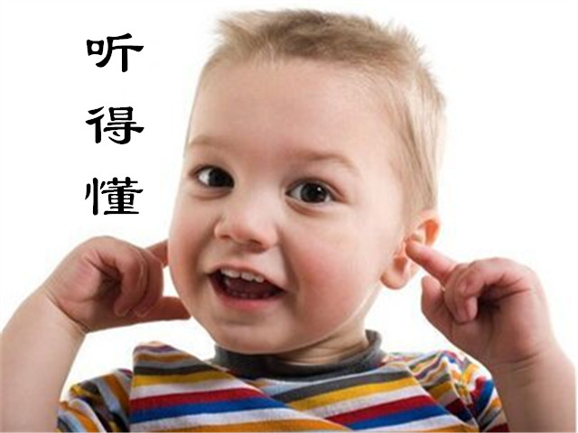

---

---

---

---

---

---

---

---

---

---

---

---

---

---

---

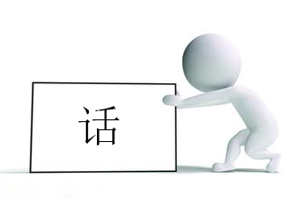

---

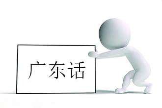

---

---

---

---

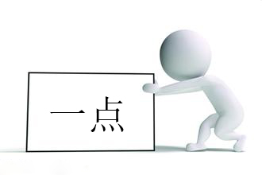

---

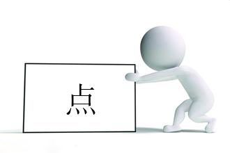

---

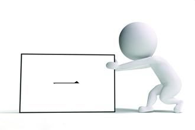

---

---

---

---

---

---

---

##一点

---

##说请问小姐

##请问小姐

---

##问你听不听得懂武汉话

##你识唔识听武汉话？

---

##试着说我能听得懂一点武汉话

##我识听一D武汉话

---

##现在两个词一起说
##武汉话
##广东话

---

---

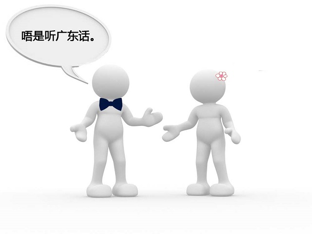

---

---

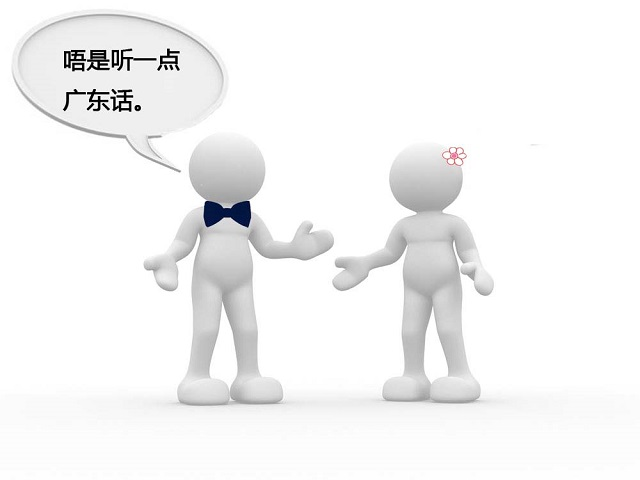

---

##湖北...

---

##湖...湖...

---

##北...北...

---

##湖北...湖北...

---

---

##湖北...湖北...

---

---

##人...人...

---

---

##人...

---

---

##湖北...湖北...

---

---

---

---

---

---

##【导引】

--

##【粤语】“我唔识听武汉话......唔识听......”

--

##【导引】

---

##【导引】

--

##【粤语】  “我唔系......唔系......唔系......我唔系......”

--

##【导引】

--

##【粤语】“你系唔系啊？系唔系......”

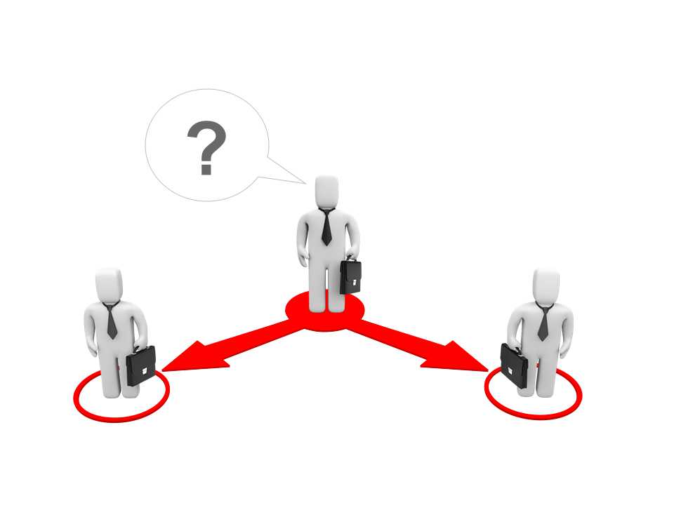

--

##【导引】

--

##【粤语】“你系唔系湖北人啊？ 你系唔系湖北人啊？”

---

##问，你听不听得懂广东话

---

#“你识唔识听广东话啊？”

---

##再问一遍，你是不是湖北人

---

#“你系唔系湖北人啊”

---

##哪一个词的意思是是
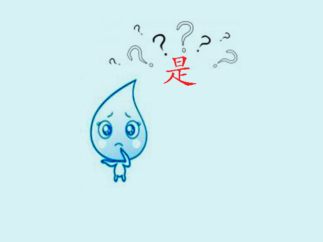
---

#“系”
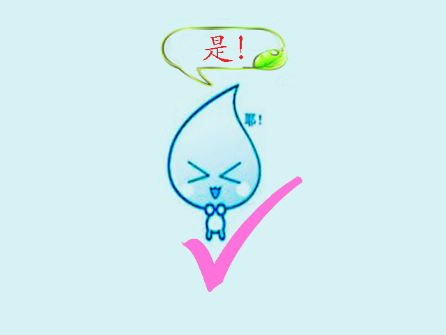

---

##用这个词来回答是

---

# “系，系”

---

##问你是不是湖北人

---

#“你系唔系湖北人啊？”

---

##回答是

---

#“系，系”

---

#“引导：是的，我是湖北人。”#

---

#“男：系，我系湖北人。”#

---

#“男：系，我系湖北人。”#

---

#“引导：现在让我们倒带回去重新听一遍你几分钟前听到的那段对话。”#

---

#“男：请问小姐，你识唔识听啊武汉话啊？”#
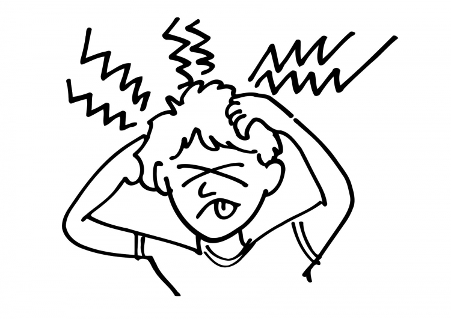

---

#“女：唔识听，我唔识听武汉话。”#
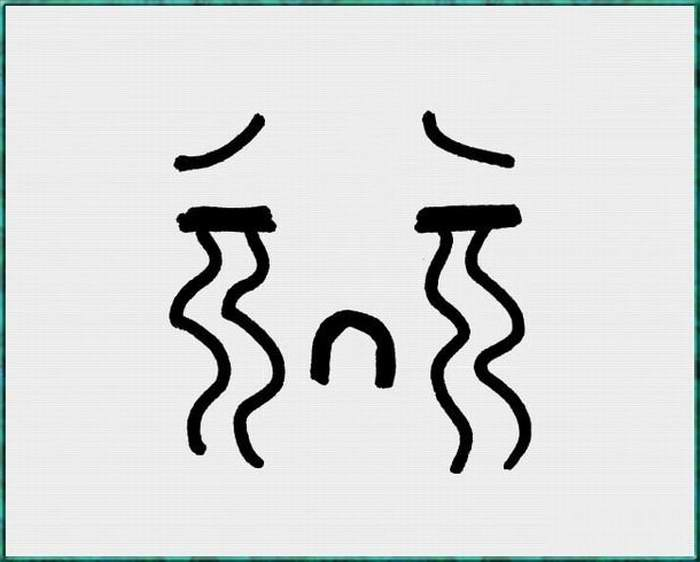

---

#“男：我识听一点广东话。”#

---

#“女：你系唔系湖北人啊？”#
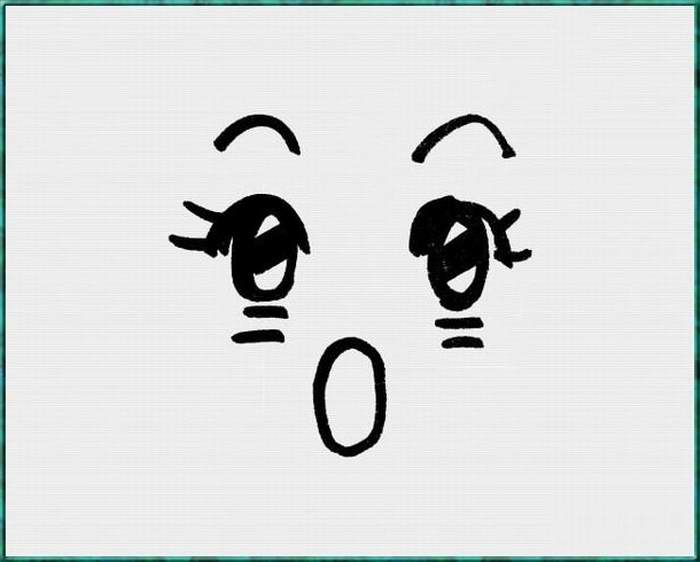

---

#男：系，我系湖北人。#

---

#“引导：再听一遍！”#

---

#“男：请问小姐，你识唔识听啊武汉话啊？”#

---

#“女：唔识听，我唔识听武汉话。”#

---

#“男：我识听一点广东话。”#

---

#“女：你系唔系湖北人啊？”#

---

#男：系，我系湖北人。#

---

---

---

---

---

##她应该怎么告诉你 她听不懂武汉话

---

##我唔识听武汉话 
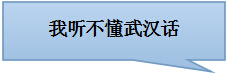

---

##她应该怎么问你 你听不听的懂广东话

---

##你识唔识听广东话？
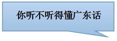

---

##告诉她 你能听的懂一点
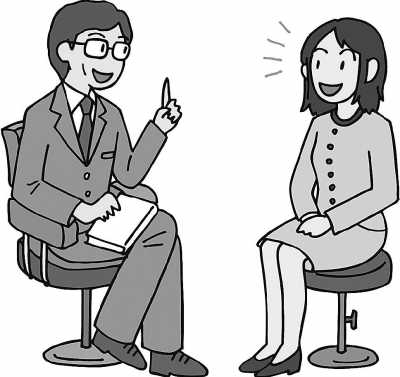

---

##我识听一D 我识听一D
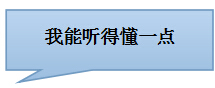

---

##她会如何问你 是不是一个湖北人呢 

---

##你系唔系湖北人呐 你系唔系湖北人呐
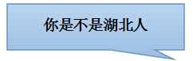

---

##告诉她 是

---

##系 系 

---

##现在她会问你一个问题 你试着正确的回答她

---

## 

"你识唔识听武汉话啊……你识唔识听武汉话啊……"

---

## 

"识听...我识听...我识听武汉话"

---

## 

她又有了另外一个问题,请用“一点”来回答她

---

##

"你识唔识听广东话啊"

---

##

"一点...我识听一点广东话"

---

##

而这正是事实。

现在你确实已经理解了一点点广东话，不必特别在意你是否能够说出每一个正确的发音，所有你已学的内容都会将在未来的几个单元里进行复习，如果你已经掌握了本单元80%的内容，那么你已经可以继续学习下一个单元，否则，你必须多花时间再重复学习这个单元，第一单元的内容到此结束。

