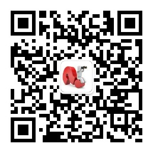

## 四人行 必有我师 ##

作为老师，我们希望自己在教学生涯中能够不断成长，行动加上反思就是专业发展最好的路径。无论你是新手教师，还是有经验的教师，都能够在这个平台上找到对自己有用的资料。让我们共同进步，成长，三人行必有我师！

### 最新消息 ###

我的微信公众号-学习创新

### 招生要求

招收勤奋刻苦、热爱研究、对教学媒体教学应用策略探究、学习与认知规律探究、传统中医感兴趣的同学。必须具有一定资源开发能力和相关认知心理学基础，有脉诊基础，能够识别不同脉象的同学优先。欢迎教育技术、心理学、计算机相关专业的同学报考。有意报考者请通过电子邮件（whenhowlee@qq.com）与我联系。

### 教学和培训 ###

[学习创新平台](http://qqda.ren/)，用于课程《教学技术与媒体》的教学内容支持！

[教学](http://4instructor.com/#!teaching.md)

[培训](http://4instructor.com/#!training.md)

### 关于我 ###

[关于我和我指导的学生](http://4instructor.com/#!about.md)，这是我和我学生的一些基本情况，在读的全日制学生都有严格的每周读书笔记制度，这是学生完成[协作写作](http://4instructor.com/#!jianshu.md)情况，每周三10点汇报[汇报安排](http://4instructor.com/#!huibao.md)，欢迎本科生们申请旁听。

2024年1月17日更新

[鄂ICP备12016981号](http://www.miitbeian.gov.cn/) 
