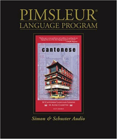
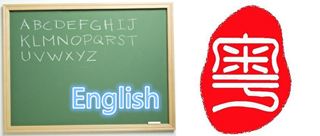
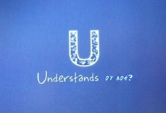
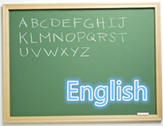

#Pimsleur Cantonese One
##Unit 2

---

【导引】This is Unit2 of Pimsleur Cantonese One. Listen to this conversation.  

---

【导引】What is the Cantonese word for “The English Language”?  
【跟读】英文 英文  
【导引】And how would you say “Cantonese”, meaning the language?   
【跟读】广东话 广东话  

---

【导引】Say “I can understand”.  
【跟读】我识听 我识听  
【导引】Did you pronunce that as the speaker did? Listen again.  
【跟读】识听 识听  

---

【导引】To be understood in Cantonese, it’s important to pronunce each word with the Cantonese intonation. Listen and repeat to practice your pronunciation.  
【跟读】我识听  
【导引】Now say “I can understand Cantonese”.  
【跟读】我识听广东话。我识听广东话。 

---

【导引】A little  
【跟读】一点 一点  
【导引】Say “I can understand a little”.  
【跟读】我识听一点。  
【导引】Now tell me that you can understand a little Cantonese.  
【跟读】我识听一点广东话。  

---

【导引】Ask me if I can understand.  
【跟读】你识唔识听啊？ 你识唔识听啊？  
【导引】Ask me if I can understand Cantonese.  
【跟读】你识唔识听广东话啊？  

---

【跟读】话啊？  
【导引】Did you hear how the speaker’s tones rolls and fell at the end of that question? “Wohaa~”, ask again can you understand Cantonese?  
【跟读】你识唔识听广东话啊？  

---

【导引】Now ask can you understand English?  
【跟读】你识唔识听英文啊？ 英文  
【导引】Try to answer “No” to the question “Can you understan?”.  
【跟读】唔识听 唔识听  

---

【导引】In Cantonese the answer “Yes” and “No” will changed depending on the question you are answering. In this case, “No” means “Can’t understand”. Ask, “Can you understand Cantonese?”.  
【跟读】你识唔识听广东话啊？  
【导引】Try to answer “Yes”.  
【跟读】识听 识听  

---

【导引】Ask the woman if she can understand the English.  
【跟读】你识唔识听英文啊？  
【导引】How would she answer “No”?  
【跟读】唔识听 唔识听  

---

【导引】Did your voice first drop then rise to a high level? Try to say “No, I can’t understand English”.  
【跟读】唔识听，我唔识听英文。 唔识听  
【导引】And now say “I can’t understand Cantonese”.  
【跟读】我唔识听广东话。  

---

【导引】Say I can understand a little.  
【跟读】我识听一点。  
【导引】Say again, “I can’t understand Cantonese”.  
【跟读】我唔识听广东话。  

---

【导引】Say, “Excuse me, Miss?”.  
【跟读】请问小姐？请问小姐？  
【导引】Listen and repeat to check your pronunciation. “Excuse me, Miss?”.  
【跟读】请问小姐？ 小姐 小姐  

---

【导引】Your voice should rise twice when pronuncing the word “Miss”. Say again, “Miss”.  
【跟读】小姐 小 姐  
【导引】Say, “Excuse me, Miss?”.  
【跟读】请问小姐？  

---

【导引】Say, “I can understand Cantonese”.  
【跟读】我识听广东话。  
【导引】Say, “I can understand a little”.  
【跟读】我识听一点。  
【导引】“I can understand a little Cantonese”.  
【跟读】我识听一点广东话  

---

【导引】Do you remember how to say “America”?  
【跟读】美国 美国  
【导引】How do you say “American person” or “American people”?  
【跟读】美国人 美国人  

---

【导引】And how do you say “You are”?  
【跟读】你是 是 你是  
【导引】Now ask, “Are you American?”.  
【跟读】你是唔是美国人啊？ 是 唔是  

---

【导引】Answer “Yes, I’m American”.  
【跟读】是，我是美国人。 是  

---

【导引】How do you think you answer “No”?  
【跟读】唔是 唔是  
【导引】Try to say, “No, I’m not American”.  
【跟读】唔是，我唔是美国人。我唔是美国人。  

---

【导引】Here’s how she might say, “I am Chinese”, just listen.  
【跟读】我是中国人。我是中国人。  
【导引】Now listen and repeat “China”.  
【跟读】中国 国 国 中 中 中国 中国  

---

【导引】Try to say “I am Chinese” or “I am a China person”.  
【跟读】我是中国人。 中国人  
【导引】What part of that means “people” or “person”?  
【跟读】人  

---

【导引】Try to ask, “Are you Chinese?”.  
【跟读】你是唔是中国人啊？  
【导引】How would she answer “Yes”?  
【跟读】是 是  
【导引】Now she says “I am Chinese”.  
【跟读】我是中国人。我是中国人。  

---

【导引】Now here’s how to say “Good morning” in Cantonese. Listen and repeat.  
【跟读】早晨 晨 晨 早 早晨 早晨  
【导引】Did you hear the tones in that first rise then fall? Say again, “Goodmorning”.  
【跟读】早晨  

---

【导引】Listen and repeat, “Good morning, Sir”.  
【跟读】先生，早晨。 先生 生 先 先生 先生 先生，早晨。  

---

【导引】The title “sir” is pronunced to two high level tones. Say again.  
【跟读】先生 先生  

---

【导引】When greeting someone the person’s name or title is said first, say “Good morning, Miss”, be careful of the tones.  
【跟读】小姐，早晨。小姐  
【导引】This can also mean “Good morning, mamma”. Say again.  
【跟读】小姐，早晨。  
【导引】She says, “Good morning, Sir”.  
【跟读】先生，早晨。 

---

【导引】Now you want to ask her, “How are you?”, listen and repeat.  
【跟读】你好吗？  
 

---  
   
【导引】It’s something like asking “You well?”. Listen and repeat “good” or “well”.   
【跟读】好 好 好  
【导引】Ask again, “How are you?  
【跟读】你好吗？你好吗？  
 

---   

【导引】Do remember how to ask “Can you understand?”   
【跟读】你识唔识听啊？  
【导引】Ask again “How are you?”      
【跟读】你好吗？   
【导引】Now say “Good morning”   
【跟读】早晨 早晨   
【导引】“Good morning, Miss”.   
【跟读】小姐，早晨。  

---   

【导引】Try to ask her, “Are you Chinese?”.  
【跟读】你是唔是中国人啊？你是唔是中国人啊？  
 

---   

【导引】How would she answer “Yes” to this question?    
【跟读】是  
【导引】She says “Yes, I am Chinese”   
【跟读】是，我是中国人。  
  

---   

【导引】Ask her, “How are you?”    
【跟读】你好吗？你好吗？   
【导引】Her answer is “Very well, thanks”. Just listen.  
【倾听】好好，多谢。  
  

---
 
【导引】First “thanks”, listen and repeat    
【跟读】多谢 谢 多 多谢 多谢   
【导引】Say again, “thanks   
【跟读】多谢  
  

---   

【导引】Ask “How are you?” or “Are you well?    
【跟读】你好吗？你好吗？   
【导引】What part of that means “good” or “well”?   
【跟读】好 好   
     

---   

【导引】This is pronunced to the rising tone. It can also mean “very”. Try to say “very well”.   
【跟读】好好 好好   
【导引】Did you hear the two rising tones? Now say “Very well, thanks   
【跟读】好好，多谢   多谢   好好，多谢  
      

---   

【导引】Say “Good morning, Sir”.   
【跟读】先生，早晨。先生，早晨。   
【导引】“Good morning, Miss”.   
【跟读】小姐，早晨。小姐，早晨。   
   

---   

【导引】Ask the man, “How he is”   
【导引】Answer “Very well, thanks”   
【跟读】好好，多谢。好好，多谢。   
   

---   

【导引】Here is how to say, “goodbye” in Cantonese. Listen and repeat.   
【跟读】拜拜    
【导引】That’s pronunced to a high and mid level tones. Say “goodbye”   
【跟读】拜拜   
【导引】And how do you say “Good morning”?   
【跟读】早晨  
  

---   

【导引】Now she ask “Are you Chinese?”   
【跟读】你是唔是中国人啊？   
【导引】 Answer the question by saying “No”   
【跟读】唔是   
【导引】“No, I’m American”.   
【跟读】唔是，我是美国人。  
【导引】“I am not Chinese”  
   

---
 
【导引】How would she say “I am Chinese”?   
【跟读】我是中国人。   
【导引】Say “goodbye”   
【跟读】拜拜   
  

---

【导引】Do you remember how to say “Excuse me, Sir?”.   
【跟读】请问，先生？  
【导引】Ask him if he can understand.   
【跟读】你识唔识听啊？你识唔识听啊   
【导引】Try to answer this question “Yes”   
【跟读】识听 识听   
   

---   

【导引】How would he say “I can understand Cantonese.”?   
【跟读】我识听广东话。   
【导引】Now she asks “Are you American?”.   
【跟读】你是唔是美国人啊？你是唔是美国人啊？   
   

---

【导引】How would you answer “Yes” to this question?   
【跟读】是 是   
【导引】Now say “Yes, I am American”   
【跟读】是，我是美国人。   
 

---   

【导引】Ask her how she is.   
【跟读】你好吗？你好吗？   
【导引】Say “very well”   
【跟读】 好好   
【导引】“Very well, thanks”.   
【跟读】好好，多谢。  
   

---  

【导引】How would you ask her if she can understand English?   
【跟读】你识唔识听英文啊？你识唔识听英文啊？   
【导引】How would she answer “No”?   
【跟读】唔识听。   
【导引】Say “No, I can’t understand English”   
【跟读】唔识听，我唔识听英文   
   

---   

【导引】She ask you if you can understand Cantonese.   
【跟读】你识唔识听广东话啊？   
【导引】Tell her, “Yes”.   
【跟读】识听   
【导引】I can understand a little.   
【跟读】我识听一点。  

---

【导引】He says “Can’t understand well”. Listen and repeat   
【跟读】唔是好识听。识听 好识听 好识听 唔是 唔是好识听   
【导引】Literally you are saying “Isn’t well can understand”, say this again.   
【跟读】唔是好识听。   

---

【导引】Say “I can understand a little Cantonese”.	   
【跟读】我识听一点广东话。   
【导引】Add modestly “Can’t understand well”.   
【跟读】唔是好识听。  
【导引】say byebye  
【跟读】拜拜。 

---   

再听一遍对话  
  

---   

#THE END