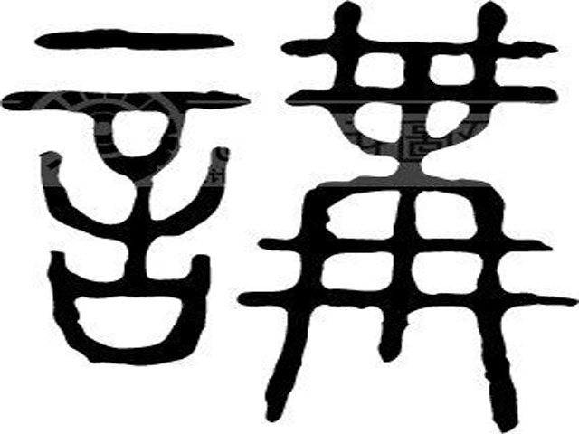
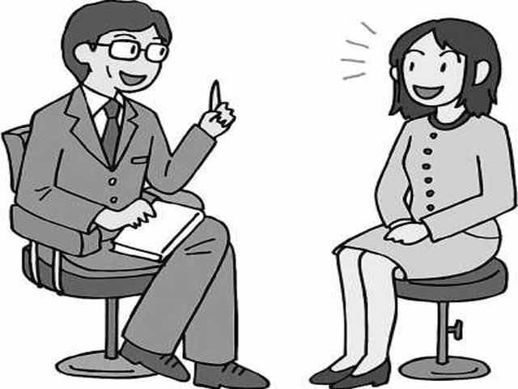
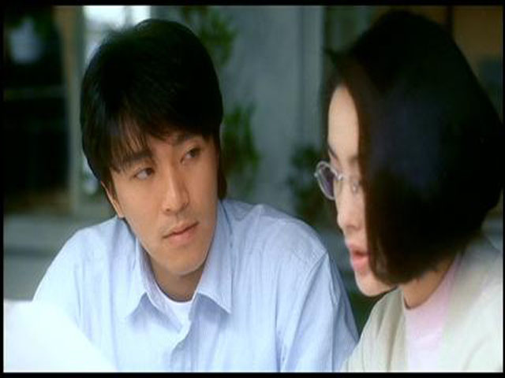
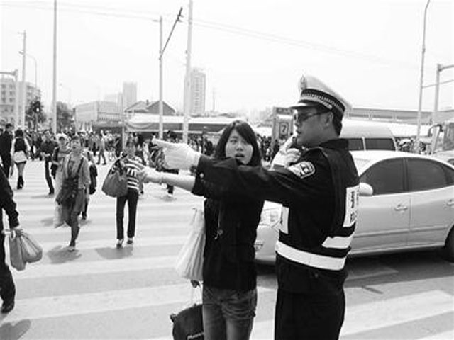
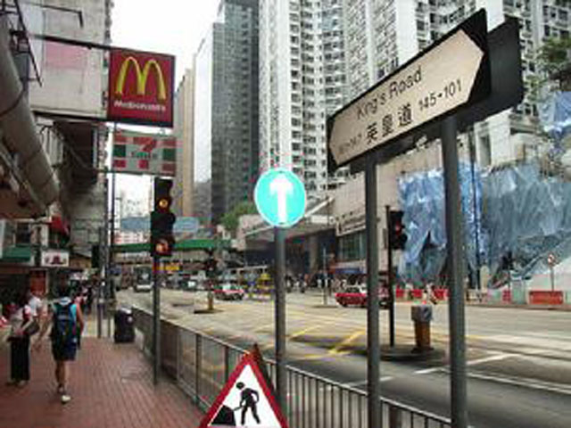
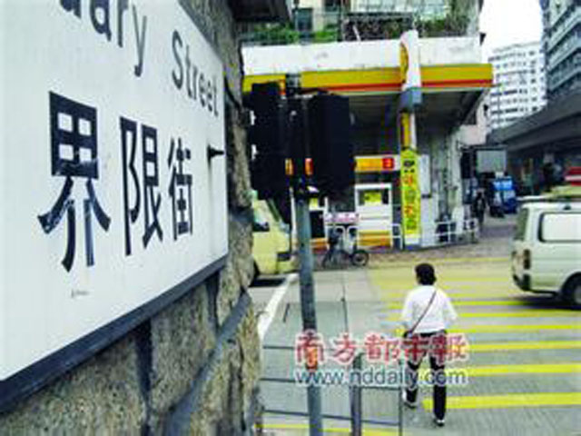
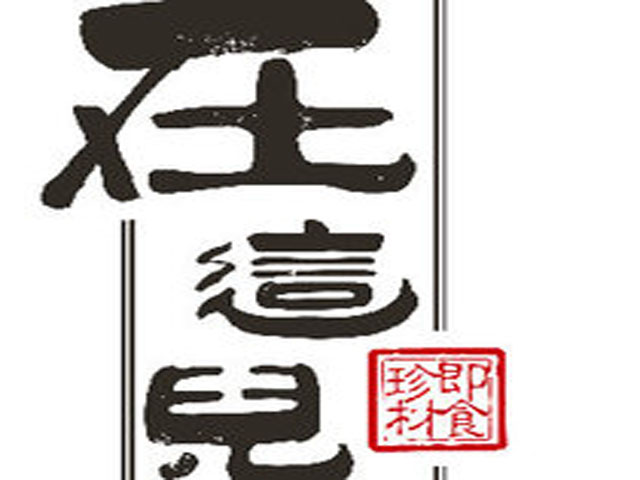
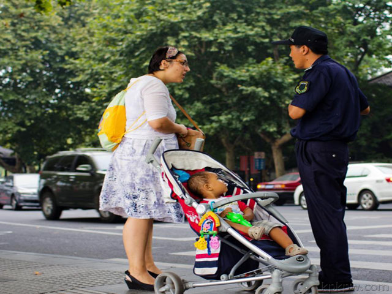

#lesson4

---
###情境导入
【男】请问小姐，你是不是中国人？  
【女】是，我是中国人。你呢？  
【男】我是美国人    
【女】但是，你听得懂好多广东话  
【男】听得懂一点，不是太懂。

---

##早晨男女互相问候  

---

##男女相见互相问好（多用于朋友中）

---

##理解的“好”与“不好”

---

##“是”与“不是”

---

##how about you?

---

##“听得懂”与 “听不懂”

---

##你呢？ 。。。 一点

---

##你讲   。。。讲  。。。你讲

---

##你讲  。。。。我讲

---

我懂  ...我会讲  
我会讲一点，但是，我不懂。

---

不太懂  
你很懂广东话  

---

我会讲一点  
我讲的不好  不好

---

好。。不好。。

好。。 不好  

我讲的不好。。的   

我讲的不好。。的  

我讲的不好

---

你听得懂英文吗？
懂  懂  。。我懂一点

---

我会讲一点 。。我会讲一点  
我讲的不好 。。我讲的不好

---

我不是美国人  你呢？  
我不是中国人

---

但是  我懂广东话  
但是  我会讲一点广东话

---

我讲的不好  
我讲的不好

---

##【问方向】  
请问英皇道怎么走？  
英皇 皇 皇 英 英皇。。。英皇

---

道  。道 。。道  。。道   
英皇道。。 英皇道  

---

在哪儿？度 度 边 边度   
边度    
  

---

英皇道在哪儿？。。。在。。在哪儿 ？   
英皇道在哪儿
 

---

在。。。‘在’与‘是’？
英皇道在哪儿？

---

街 街 街 街  
界限街  界 限 限街 街 界限街   界限街

---

在哪儿？  
界限街在哪儿？

---

这儿   
度 幂 密度  密度

---

在 在  
在这儿  在这儿 在   

---

英皇道  
英皇道在哪儿？  
请问，英皇道在哪儿？  
   
在这儿   
是不是在这儿 ？   
是不是在    
是不是在这儿？ 

---

是不是在这儿？  
是的，在这儿

---

我讲的不好  
我讲的不好 

---

请问，是不是在这儿？   
不是在这儿 是在那儿。。。那儿 是在那儿

---

那儿 。。 
是在那儿。。
  
不是在那儿。。 不是在那儿 
  
是在这儿？。。

---

界限街在这儿   
界限街在这儿

---

界限街在哪儿？  
是在这儿吗？  
不在这儿，是在那儿

---

【女】先生，早上好。  【男】小姐，早上好。 
【女】你好吗？  【男】很好，谢谢 

---

【男】我很好，你呢？。。。你好吗  
【女】我很好，你是不是美国人？    
【男】是，小姐。我是美国人  
【女】我是中国人。你听得懂广东码？    
【男】一点，我懂一点广东话。

---

我懂一点  
你很懂广东话    
你很懂广东话

---

不是太懂  不是太懂  
。。。。。
我会讲一点广东话  
我讲的不好    
我讲的不好

---

请问，英皇道在哪儿？  

是在这儿吗？  
是不是在这儿？  
是的，它就在这儿

---

界限街是在这儿吗？
在那儿  
英皇到不在那儿  
界限街在那儿  
但是，英皇道就在这儿  

---
  
##再见  再见   

---

#This is the end of unit 4.

  
 

