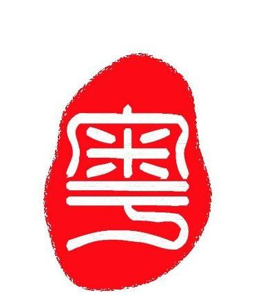

#粤语材料第五单元
This is unit 5 of king’s road Cantonese one, listen to this conversation

---

请听对话
###请问小姐英皇道在那里啊
###在这里
###界限街呢？
###在那边
###你好吗？
###我很好，多谢，拜拜。
###拜拜

---

###Do you remember how to say good morning in Cantonese?
###早晨
###As in English this greeting used before noon to greet someone at any time of the day.
###You will simply say hello. Listen and repeat.
###你好。。。。。。。。你好
###Literally it is just you are well. Say again hello
###你好

---

###And how do you ask how are you or are you well.

###In Cantonese you don’t use this two together. The question how are you is understood when you say hello, say again hello.

---

#请听对话

---

###Then how would you say I don’t speak well or I speak not well.
###我讲得不好。 讲。。。。。。讲得。。。。。我讲得不好。

---

###Now ask how about you.
###你呢？
###Can you speak Cantonese or do you know Cantonese ?
###你会不会讲广东话啊？。。。。。。。 会不会？

---

###Listen to the answer. Yes, I can speak Cantonese.
###会，我会讲广东话。会。
###In this case, the answer yes is simply can or know how to. Now you answer yes I know how to speak Cantonese.
###会，我会讲广东话

---

#Now she says you speak Cantonese very well, listen and repeat

#Notice the word order,say you speak Cantonese very well

---

###And how would you say you can understand Cantonese very well?
###你识听好多广东话，识听，好多
###Say,you speak Cantonese very well
###你广东话讲得好好
###Say modestly, I don’t say very well
###我讲得不好，我讲得不好

---

#Ask how are you
#Now say I'm very well
#Did you pronounce that with two different rising tones?Now ask How about you?

---

#Do you remember how to say Hello?
#你好，你好

---

###Say King’s road

###英皇道，英皇道

###And now say Boundary Street

###界限街，界限街
###Ask where it is？Or it is located where？

###在哪里啊？

###Answer where boundary street is located。

###界限街在哪里啊？

---

###Say excuse me

###请问

###Excuse me, here is king’s road located?

###请问英皇道在哪里啊？

###Say it is located here

###在这里

---

#询问
###Do you remember how to ask is it located here?
###是不是在这里啊？是不是在这里啊？

---

###How would she tell you it is located over there?

###在那边

###Now say it is not located over there

###不在那边，不在那边

###She says but it is not located over there. Say king’s road is not located over there?

###女：英王道不在那边

###Say but boundary street is located here.

###但是界限街在这边

---

###Ask her excuse me, where is king’s road located?

###请问英王道在哪里啊？

###Listen to the answer, I don’t know.

###我不知道，我不知道

###Repeat after the Speaker

### 我不知道，道，知，道，知道，不，不知道。

---

###Don‘t know is pronounced with a combination of falling high and mid-level tones.Say again Don’t know.

###How do thank you with say I know.

---

###Ask him where boundary street is located？
###界限街在哪里啊？
###Answer I don’t know
###我不知道
###Say but I know
###但是我知道
###Say it is located over there。
###在那里

---

###How do you thank you say I know.
###你知道
###Now you want to ask,do you know? Listen and repeat.
###你知不知道啊？知，知，不知道，知不知道，你知不知道啊。

---

###Notice the short form of 知道 used to ask this question. Ask again do you know?
###你知不知道啊
###Now say you know
###你知道
###She answers yes, I know. Listen and repeat.
###知，我知道。知，我知道

---

###You use this shout form of the word know both to ask and answer the question. Do you know ask the question again.
###你知不知道啊。
###How does she answer yes I know.
###知，我知道。
###It is not over there. 
###不在那里。

---

###How does she say you speak Cantonese very well.
###Be careful with the word order.
###你广东话讲得好好。
###Say modestly I don’t speak very well.
###我讲得不好，我讲得不好。

---

###Let’s learn how to ask with things with Cantonese. First here is how to say “I want to” , listen and repeat.
###女：我想，想，我想。
###想 is pronounced with the mid rising tone. Say again I want to.
###我想
###Now say you want to.
###你想

---

###Say I know.
###我知道。
###Ask do you know.
###你知不知道啊？  知。

---

###How would you answer the question with the shout form.
###知。
###Say again you want to.
###你想。
###Try to ask do you want to. 
###你想不想啊？你想不想啊？

---

###Ask again do you know.
###你知不知道啊？     知
###Try to answer no.
###不知道，不知道。
###How do you thank you say I don’t’ want to.
###我不想，不想。
###Ask again do you want to.
###你想不想啊？

---

###Here is how to say you want to eat something, just listen.
###你想吃点东西。
###Listen and repeat the word to eat.
###吃。。。。。吃
###Say again to eat. Pay special attention to the tone.
###吃 
###How do you say can?
###识
###The difference between the two is that can is spoken with the high level tone and to eat is pronounced at a low level. Try to say I want to eat.
###我想吃。

---
   
###Listen and repeat something.
###一点野，点，点，一点，一点野。
###You say literally a little thing, what part of that means thing.
###野，野。
###It’s pronounced with the low rising tone. Say again something.  
###一点野
###Say you want to eat something.
###你想吃一点东西。

---

###Now try to ask do you want to eat something.
###你想不想吃一点东西啊？你想不想只一点东西啊？
###How would you answer this question yes.
###想，想。
###Now say I want to eat.
###我想吃
###Did you match the low level tone in the word to eat, now say yes I want to eat something.
###想，我想吃一点东西。想，我想吃一点东西

---

###Do you remember how to say hello. 
###你好，你好。
###Ask her if she wants to eat something.
###你想不想吃一点东西啊？
###Answer this question, no thanks.
###不想，多谢。不想，多谢。
###She says but I want to drink something. just listen.	
###但是我想喝点东西 

---

#Listen and repeat to drink. This word has a mid rising tone.
###喝。。。。喝。。。喝
#Say again to drink.
### 喝
#Say I want to drink something.
###我想喝点东西。

---

###Now try to ask her do you want to drink something.
###你想不想喝点东西啊？
###How does she say I don’t know.
###我不知道，我不知道。
###Say I want to eat something.
###我想吃一点东西，我想吃一点东西。

---

###Ask her again if she wants to drink something.
###你想不想喝点东西啊？你想不想喝点东西啊？
###How would she answer this question no thank you.
###不想，多谢。不想，多谢。
###Now she says but I want wo eat something.
###但是我想吃一点东西。

---

###Ask do you want to drink something.
###你想不想喝点东西啊?
###Answer no thank you but I want to eat something. 
###不想，多谢，但是我想吃点东西。
###Say again but.
###但是

---

 
###Now say good morning.
###早晨，早晨
###And how would you say hello.
###你好，先生你好
###Ask the woman if she can speak English.
###你会讲英文吗?
###How does she answer no? say literally can’t.
###不会，不会。

---

#Tell her that you can speak a little Cantonese.
###我会讲一点广东话。
#Tell her I don’t speak well.
###我讲得不好
#How would she say you speak Cantonese very well.
###你广东话讲得好好，你广东话讲得好好

---

###Say boundary street.
###界限街。
###Ask where the street is located.
###界限街在哪啊?界限街在哪啊?
###Try to ask is it located here.
###是不是在这啊？ 是不是在这啊？ 
###How does she tell you it’s not located here, it’s located over there.
###不在这，在那里。

---

###Ask her where king’s road is located.
###英皇道在哪里啊？
###Do you remember how to ask do you know.
###你知不知道，你知不知道。
###How does she answer no I don’t know.
###不知，我不知道，不知。
###She corrects herself says yes I know, how would she say this.
###知，我知道， 知，我知道。

---

 
###Now she tell you she wants to eat something.
###我想吃一点东西
###Ask her if she wants to drink something.
###你想不想喝点东西啊？你想不想喝点东西啊?
###How does she answer she answer no thank you .
###不想，多谢。不想，多谢。
###How does add but I want to eat something.
###但是我想吃点东西。
###Now say but I don’t want to eat.
###但是我不想吃

---

#Say good bye to her.
# 拜拜
# 拜拜
#This is the end of unit five

 

