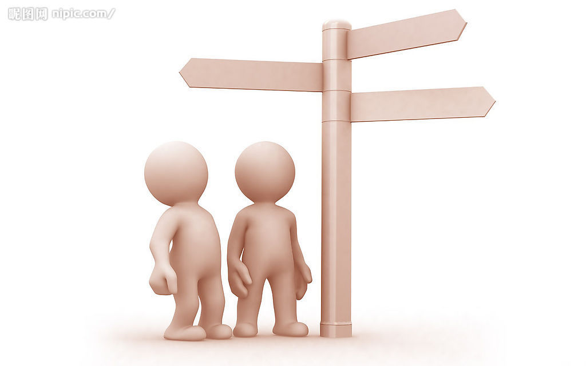
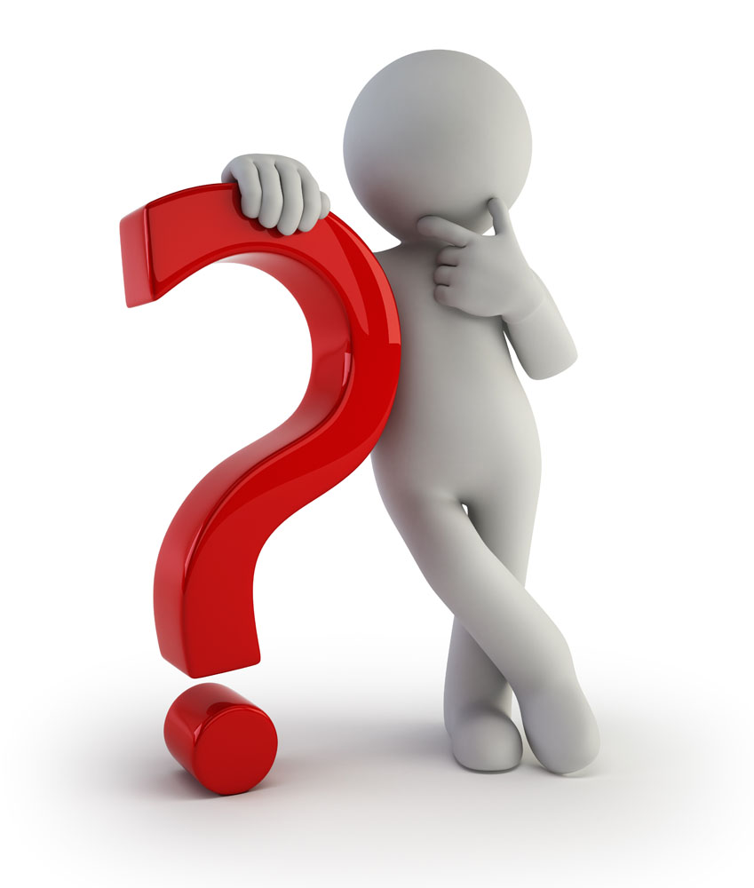

第六单元

---

——小姐，早晨好

——先生，早晨好，你好吗？

——我好，多谢。我想吃一些东西，你呢？

——我也想

——你想不想喝一点东西啊？

——想

——去哪里啊？

——界限街

---

——界限街在哪啊

——在这里

——界限街不在这里

——你呢？

——英皇道

——英皇道呢？

——在那里

——是不是在这里啊
 
——不是，不在这里

---

——英皇道在那里

——你讲

——你讲的好

——你广东话讲的很好

——我能听懂一点

——我会讲一点

——我讲的不好

---

——你好(你好)

——小姐，你好（小姐，你好）

——你想不想吃一点东西啊？（你想唔想食一D野啊？）

——想，我想吃一点东西（想，我想食一D野）

——你想不想喝一点东西啊？（你想唔想饮一D野啊？）

——想，我想喝一点东西（想，我想饮一D野）

---

——不想，多谢（唔想，多谢）

——你想不想吃一点东西啊？（你想唔想食一D野啊？）

——想，我想吃一点东西（想，我想食一D野）

——不想，多谢，但是我想喝一点东西（唔想，多谢，但系我想饮一D野）

---

——你能不能听懂？（你识唔识听？）

——听不懂（唔识听）

——你讲的很好（你讲得好好）

——我讲的不好（我讲得唔好）

---

——请问界限街怎么走啊？（界限街起边度啊）

——你知不知道啊？（你知唔知道啊？）

——不知，我不知道。（唔知道）

——不在这里（唔起个度 ）

---

——不在这里（唔起个度 ）

——小姐，你好（小姐，你好）

——你想不想吃一点东西？（你想唔想食一D野啊？）

——想，我想吃一点东西（想，我想食一D野）

——你想去哪吃啊？（你想去边度食啊？）

---

——你想去哪里吃啊？（你想去边度食啊？）

——我想去我那里吃（我想去你度食）

---

——我想去你那里（我想去你度食）
      
——我也想（我都想）

---

——你想去我那里吃吗？（你想唔想去我度食啊？）

——我也想（我都想）

---

——何时啊？（几时啊）  

——现在（依家）

---

——你想什么时候吃（你想几时食啊？ ）

——现在（依家）

——我也想（我都想）

——现在不行（依家毋想）

---

——过一会（迟D）

——现在（依家）

——你想什么时候喝点什么吗？（你想几时饮啊？）

——我不知道（我唔知道）

---

——不了，谢谢（唔想，多谢）

——但是我想吃些东西（你想食一D野 ）

——我也想（我都想）

——你想去哪里吃（你想去边度食啊？）

---

——我想去你那里（我想去你度食）

——你想什么时候喝点什么吗？（你想几时饮一D野啊？）

——现在不行（依家毋想）

---

——去哪啊？（去边度食啊？）

——何时（几时啊）

——你想什么时候喝点什么吗？（你想几时饮啊？）

——现在不行（依家毋想）

——过一会（迟D）

——你想去哪里吃啊？（你想去边度食啊？）

---

——我那里（我度）

——我想去我那里吃（我想去我度食 ）

——我不想去你那里吃（我唔想去你度食）

——我想去我那里吃（我想去我度食 ）

---

——我不想去你那里吃（我唔想去你度食）

——但是我想喝一点东西（但系我想依家饮一D野）

——也（都）

——我也想喝一点东西（我想饮一D野）

---

——你想什么时候喝点什么吗？（你想几时饮一D野啊？）

——你想过一会再喝东西吗（你迟D想唔想饮啊？）

——不，我想现在喝（唔想，我依家想饮）

---

——你想去我那里喝点吗？（你想唔想去我度饮一D野啊？）

——是的（想）

——我想一会吃点东西（我迟D想食一D野）

——但是我想现在喝点东西（但系我想依家饮一D野）

---
