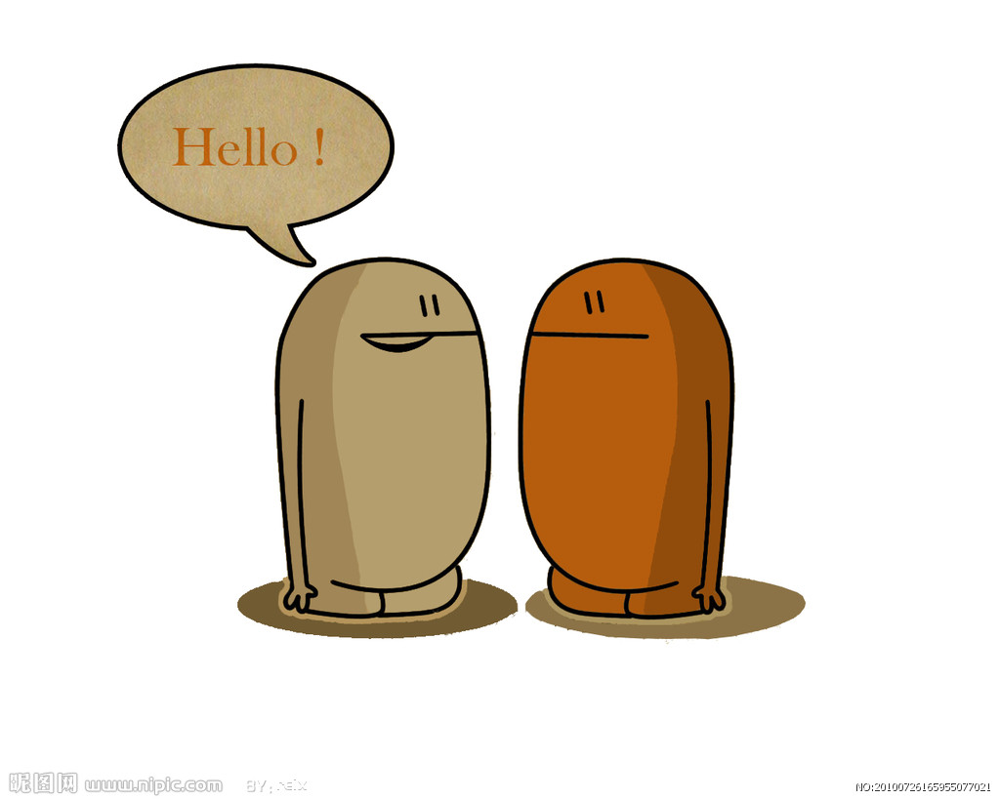
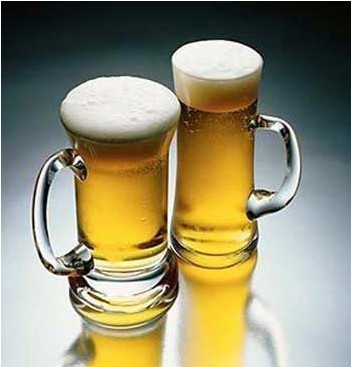
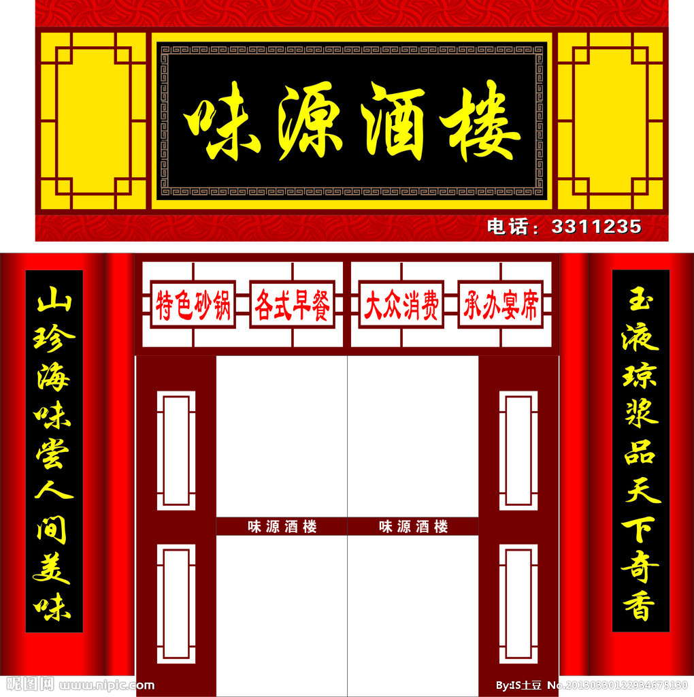

This is unit 7 of Cantonese 1 

---

Listen to this conversation。

---

你想什么时候吃饭？是不是现在

不是，我想迟点吃。但是我现在想喝点东西

---

你想去哪里喝？  

我不知道

---

你想不想去我那里喝  
不想，我想去酒楼喝 

---

You just hear"酒楼"，the restaurant 酒楼

---

Listen again:   
你想什么时候吃饭？是不是现在  
不是，我想迟点吃。但是我现在想喝点东西  
你想去哪里喝？  
我不知道  
你想不想去我哪里喝  
不想，我想去酒楼喝 

---

Ask"Where do you want to go to eat?" 你想去哪里吃饭？

---

Answer"to my place or to go to my place."去我那里吃吧,去我那吧。

---

And how would you to say"I don't want to go to your place"             我不想去你那里,我不想去你那里

---

Now tell me that you want to eat something.我想吃点东西

---

Do you remember how to say"I to,want to "我也想,我也想

---

Ask when 什么时候?   Say now 现在,现在

---

Try to say I want to eat now,be careful the word:我现在想吃,我现在想吃

---

Ask me if I want to drink something:你想不想喝点东西

---

Answer yes:想，想

---

Do you remember how to say hello:你好，小姐你好,先生你好

---

Ask again"Do you want to drink something?"你想不想喝点东西?

---

Now answer:"No ,think". 不想，谢谢.不想，谢谢.

---

Say"but I want to eat something." 但是我想吃点东西. Say"I too want to"我也想,我也想.

---

Ask "when":什么时候,什么时候.   Say"later"迟点,迟点.

---

And how would you to say"now"现在,现在.

---

But not here,laterly you would say"but it's not locate here".但是不是这里,不是这里.

---

Try to ask"it is located over there?":是不是在那里啊？ 是不是在那里啊？   
Answer"No,it's not located there":不是，不在那里.

---

Ask"It's located where?"在哪里？  在哪里？

---

Ask"where do you want to go to eat?"你想去哪里吃？  去哪里?  
Answer"to your place."去你那里,去你那里.  
She answers"OK,it's the same word for good or well."好,好

---

Now say"I don't speak well or laterly I speak not well."我说的不好，不好.Try to say" not OK"不好,不好.

---

Try to say"I want to eat here",you will say laterly"I want to be located here to eat"我想在这里吃,我想在这里吃.

---

Ask him where he wants to go to eat:你想去哪里吃？His answer is to the restaurant,listen and repeat:去酒楼，楼，酒，酒楼，酒楼.

---

The Cantonese word restaurant is pronunced with the ,say again restaurant:酒楼.  now say:to the restaurant or to go to the restauran:去酒楼,去.

---

Try to ask"OK?",laterly "ok,not ok?" 好不好啊？ 好不好啊？               now say "very good":好的,好的.

---

Do you remember how to ask when do you want to eat?你想什么时候吃？

---

Now ask"where do you want to go to eat?"你想去哪里吃？

---

Here is how to ask "what do you want to eat",,listen and repeat:你想吃什么东西？什么东西,什么,东西，什么东西,什么东西

---

Using a high lever and no reasing tone: 什么东西,什么东西.    ask again"what you want to eat?":你想吃什么东西？你想吃什么东西？

---

Notice the different wold,laterly you ask him you want to eat what,now ask her where she wants to go to eat:你想去哪里吃？How would she answer“to the restaurant”:去酒楼,去,去酒楼.

---

Ask "OK?"好不好啊?好不好啊?  say"OK":好.  say"I want to drink something":我想喝点东西.

---

Now try to ask"What do you want to drink?"你想喝什么东西?什么东西?你想喝什么东西?

---

Here is how to say"some wine",,listen and repeat:一点酒，酒,酒,酒.  say again"wine":酒,酒.

---

Now try to say""some wine"or laterly"a little wine":一点酒,一点.   Say "I want to drink some wine":我想喝一点酒.

---

Do you remember the  Cantonese wold restaurant:酒楼.laterly wine place.Ask again:what's she want to drink?你想喝点什么东西?ask "do you know?"你知不知道啊？你知不知道啊？ answer "no":不知道,不知道.

---

Try to ask if she wants to drink some wine:你想不想喝点酒啊?你想不想喝点酒啊?How she answer this question:no,think you:不想，谢谢. 

---

Now answer"Yes,I want to drink some wine":想，我想喝点酒.

---

I want to drink some beer,listening and repeated,beer.
啤酒，酒，啤酒,啤酒

---

this is pronunce to the high lab tone follow by and made reasing tone，say again,beer.啤酒 

---

try to say some beer or a little beer.一点白酒

---

do you remember how to ask OK? 好不好啊？好不好啊？

---

say I want to drink some wine.我想饮一点酒，我想饮一点酒

---

say I want to drink some beer.我想饮一点白酒，白酒，我想饮一点白酒

---

ask where do you want to go to drink.你想去哪里喝？

---

try to ask do you want to go to my place to drink.你想不想去我那里喝啊？去我那里，你想不想去我那里喝啊？

---

she says no 不想  she says I want to go to the restaurant to drink. 我想去酒楼饮,我想去酒楼饮

---

say but later,OK.但是，迟点，好不好啊？迟点

---

do you remember how to say not now. 现在不想

---

say OK.好，好.how to you say hello in cantonese.你好，你好

---

do you remember how to tell someone you want to eat something.我想吃一点.how what do you say I to want to eat something. 我都想吃一点，都

---

I want to drink something.我想饮一点，我想饮一点

---

ask if she wants to drink something.你想不想饮一点，你想不想饮一点。how do she anwer no thank you.不想，多谢，不想，多谢

---

how to she says not now,later,OK.人家不想，迟点，好不好啊？迟点

---

but I want to eat something.但是我想吃一点.ask if she wants to eat now.你现在想不想吃啊？你现在想不想吃啊？

---

how to she anwer OK.好，好.ask where she wants to go to eat.你想去

---

how to she anwer I want to go to the restaurant to eat.我想去酒楼吃，去酒楼，我想去酒楼吃.

---

say OK.好.ask when.什么时候，什么时候.how to she say I want to eat now.我现在想吃,我现在想吃

---

now she says I want to go Meixin restaurant，listening and repeated.我想去美心酒楼，,美心，心，美心，美心酒楼，美心酒楼，我想去美心酒楼.

---

and high lab tones,say the name Meixin.美心，美心.ask where she wants to go to eat.你想去哪里吃

---

answer to Meixin's restaurant.去美心酒楼，去美心酒楼

---

try to ask where this restaurant is located.美心酒楼起边度啊？起边度啊？美心酒楼起边度啊？

---

ask do you know.你知不知道啊？你知不知道啊？answer,yes,I know.知，我知道，知，知，我知道

---

how to she tells you it's located over there.在这里.what do you want to eat.你想吃什么，你想吃什么

---

how to she says I don't know.我不知道，我不知道.ask what do you want to drink.你想饮什么

---

now she says I want to drink something.我想饮一点，我想饮一点

---

ask do you want to dring some wine.你想不想饮一点酒，你想不想饮一点酒，不想

---

ask she wants to drink some beer.你想不想饮一点白酒，你想不想饮一点白酒

---

now she answers no thanks.不想，多谢.answer,not now thanks.人家不想，多谢，人家不想

---

how to she says I want to dring some wine.我想饮一点酒.how to she asks later,OK,be careful of the world water.迟点，好不好啊？迟点，好不好啊？

---

say OK.好.say not now.人家不想.

---

now try to say but I want to drink something now.但是我现在想饮一点

---

this is end of unit 7
