###this is unit 8 of cantonese one,listen to this conversation between mister LI and miss WANG

李先生，王小姐

 

---

###they are sitting in the restaurant，and at one point mister LI ask the waitress,calling him simply 

小姐，王小姐，你依家想唔想食一D野啊

唔想，多谢李先生，依家唔想，但是，我想饮一D液

好，你想饮么液呀
 
我不知道，一D酒，不是，一D啤酒

我都想要一D啤酒，小姐，我要两杯啤酒

---

###in the conversation,you hear the man tell the waitress

我要两杯啤酒

###that means I want two beers

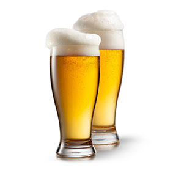

---

###listen again

王小姐，你依家想唔想食一D野啊

唔想，多谢李先生，依家唔想，但是，我想饮一D液

好，你想饮么液呀

我不知道，一D酒，不是，一D啤酒

我都想要一D啤酒，小姐，我要两杯啤酒

---

###here how to say to eat lunch,listen and repeat

食晏- 晏-食-宴-宴

###the word lunch pronunch middle level tone,how do you say lunch

宴

###say again,to eat lunch

食晏

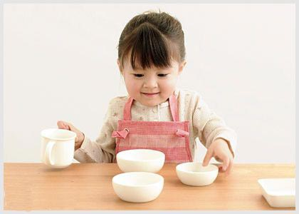

---

###try to ask someone if she wants to eat now

你依家想唔想食晏

###answer yes,I want to eat lunch

想,我想食晏，食晏

---

###listen and repeat to practice your pronunciation

食晏- 晏,食晏,我想，我依家想食晏

---

###and now listen and repeat the same statement and conversational speed

我依家想食晏

---

###ask her where she wants to go to eat

你想去哪里吃？

---

###try to ask do you want to go to the restaurant to eat

你想唔想去酒楼食啊？

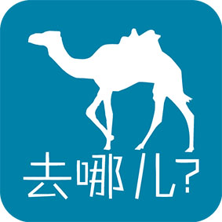

---

###answer,yes,I want to go to maxrian restaurant

想，我想去美心酒楼，美心酒楼

---

###now answer,no,I want to go to your place

不想，我想去你斗，去你斗

---

###do you remember how to say "i also want to"

我都想，我都想

###say but later ok?

但是，迟点好不好啊

---

###ask her if she wants to drink something now

你依家想唔想饮一D液啊

###now ask her what's she wants to drink

你想饮么液呀

---

###listen to these two questions togther and think what they mean

你想唔想饮一D液啊,你想饮么液呀

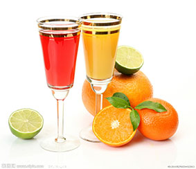

---

###and now ask whether she wants to drink something

你想唔想饮一D液啊

###ask her when she when to drink something

你想几时饮一D液啊，几时，你想几时饮一D液啊

---

###ask her if she wants to drink something now

你依家想唔想饮一D液啊

###ask again what's she wants to drink

你想饮么液呀

---

##ask her if she wants to drink some beer

你想唔想饮一D啤酒啊

###she order to beers,just listen

我要两杯啤酒 ,我要两杯啤酒 

---

###later he say,I want two cups of beer,listen and repeat the number two

两-两-两

###can you guess the tone,it's a law rising tone,now listen and repeat two cups

两杯- 杯- 两杯 

---

###the word cups is pronouced with high level tone,say again "two cups"

两杯

###try to say "two cups of beer"

两杯啤酒 

---

###I want two cups of beer,listen and repeat this word for want

要-要-要

###did you her the middle level tone,say "I want"

我要-要

###now say"I want two cups of beer"

我要两杯啤酒

---

###this is the word that you used to say that you want something,now ask "do you want to drink something"

你想唔想饮一D液啊,想

---

###tell me again that you want two beers

我要两杯啤酒,要

---

###ask "do you want to drink some beer"

你想唔想饮一D啤酒啊

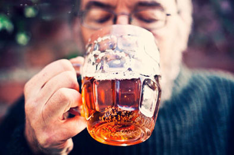

---

###listen and repeat the cantonese word "or"

抑或- 或-抑或-抑或

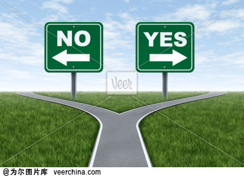

---

###this word pronouced with high and low level tones,say "or"

抑或-抑或

---
###try to ask do you want to drink beer or wine

你想饮啤酒亦或酒啊，你想饮啤酒亦或酒啊

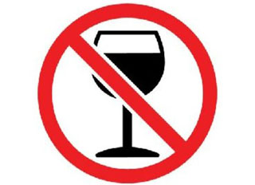

---

###you don't need want,don't want with "亦或"，because the answer won't be yes or no.ask me again if  you want to drink beer or wine

你想饮啤酒亦或酒啊

---

###say some wine

一D酒,酒,酒-酒 ,一D酒 
 
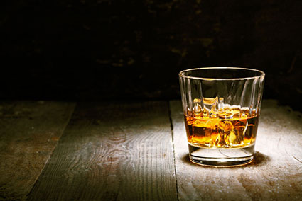

---

###say ok

好-好

---

###try to ask do you want to drink some wine or beer

你想饮一D酒亦或啤酒啊

###how do you say "I want some wine"

我要一D酒,我要一D酒

---

###say again "I want to drink"

我想饮

---

###now say "I don't want to "

我不想，不想

---

###remember the falling tone with the "不"，listen and repeat to practice the pronunciation

不想,不想

###do you remember how to say "I don't want to drink wine"

我不想饮酒

---

###I want to drink some beer

我想饮一D啤酒,我想饮一D啤酒

---

###and how would we tell the waitress that I want two beers

我要两杯啤酒

---

###ask do you want wine or beer

你要酒亦或啤酒啊，酒亦或啤酒

---

###say I don't kown

我不知道,我不知道

---

###ask the young woman what's she wants to eat

你想食么野啊

###now listen and repeat the question,what do you want to do 

你想做么野啊-做-做

---
###the word to do is pronunced with a low level tone,say again to do

做-做

###try to ask me what I want to do 

你想做么野啊

---

###what do you want to do now,be careful to the word order

你依家想做么野啊，你依家想做么野啊

---

###answer I want to drink something now

我依家想饮一D液啊

---

###我现在想喝点东西  你想去哪里喝点东西呀  去酒店  酒店  店  酒  酒店  

---

###now try to say，I want to go to the hotel

---

###我想去酒店 去哪里 我想去酒店 我想去酒楼
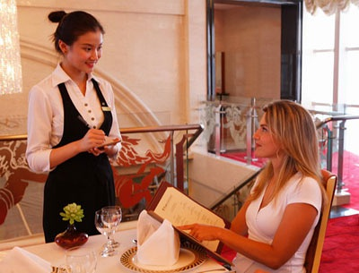

---

###what's the word“or”in Contonese？

---

###抑或  你需要酒或者啤酒吗
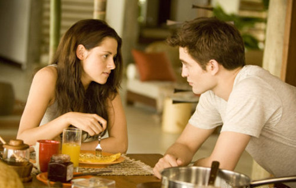

---

###and now ask me what I want to do

---

###你想做什么呢  做 我想买点东西 买 你想买什么啊 我想买点东西

---

###now try to say，I want to do something.

---

###我想做些事 我想去酒店 你想去哪里 哪里 我想去酒店喝点东西 你需要酒或者啤酒吗 抑或 我要两杯啤酒 两杯啤酒

---

###now listen to the question ，with whom

---

###和谁啊 和 和谁啊 谁啊 啊 啊 谁 谁啊 谁啊 和谁啊 和你

---

###say I want to do something.

---

###我想做些事 你想不想买点东西 买 不想，我现在想吃午饭 和谁啊 和你
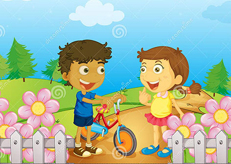

---

###now let's try a conversation with the woman，begin by saying good morning to her

---

###早上好 早上好，小姐   早上好，先生   最近好吗  很好，多谢  和你

---

###ask her what she wants to do now

---

###你现在想干嘛  我不知道，你呢  我不知道  你想不想喝点东西 想，我想喝点东西  和谁啊  你想不想和我一起喝点东西  和我  想，多谢，什么时候  现在
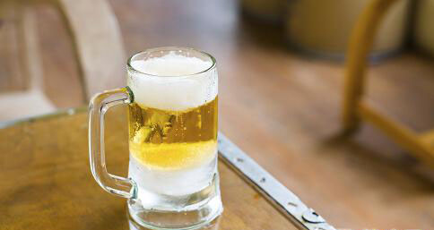

---

###ask her where does she want to have a drink

---

###你想去哪儿喝点东西  你想不想去酒店喝点东西  不想，我想去“美心”酒楼喝  好

---

###ask her where maxine restaurant is located

---

###“美心”酒楼在哪里 你知道么 我不造，你呢  知道，我知道  就在那里

---

###you've reached the restaurant，ask her what she want to drink

---

###你想喝什么  你需要酒抑或啤酒么  我要一点酒 你想不想吃午饭啊  现在不想，过会儿行么  好
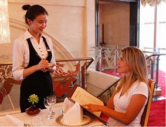

---

###tell her you want to buy something.

---

###我想买点东西 买 你想买什么 你想买酒抑或啤酒么 我要一点酒 我想和你一起吃饭

---

