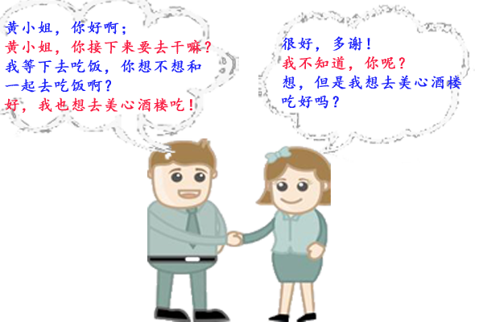
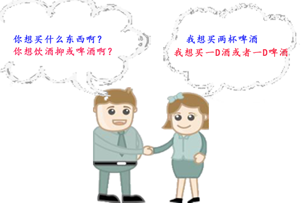
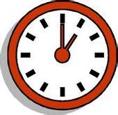
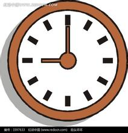
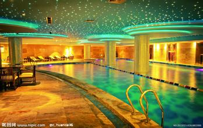
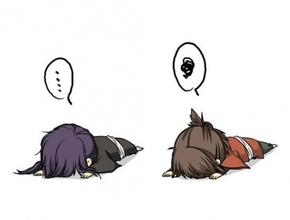

第九单元  
主要人物：黄小姐、李先生  
场景：互相问候，去美心酒楼吃饭    

---

---

你好吗？   

你听得懂广东话吗？

--

界线街在哪里啊？

你知不知道界线街在哪里啊？

--

--

--

--

--

--

--

---

---

--

但是不是在这里。

不是酒店；
我不想去酒店 

--

你想干什么呀？
我想喝点东西，或者吃点东西！     或者

我想去你那里喝一点东西~     去你那里

好不好啊？    好，我也想喝点东西。

--

你要什么啊？

你想买什么呀？   想

几时呀？

几点钟啊？  钟  点   点钟  

--

一点钟    一

点钟     一点钟         

几点钟啊？

--

一点钟

九点钟    九     九点钟

几点钟啊？

一点钟或者九点钟     或者

--

八     八点钟

是不是在八点钟啊？  是不是

不是，是九点钟

--

我要两杯啤酒   两    两点钟

八点钟

一点钟

不是九点钟   不是两点钟

--

或者

一点钟或者两点钟啊？

两点钟好不好啊？

好，但是我想去酒店吃饭！

八点钟   八   九点钟

几时啊？   几点钟啊？

--

我不知道！

两点钟好不好啊？

好，去酒店！

---

请问

美心酒楼在哪里啊？

在那里

你想干什么啊？      我唔知道

你想不想和我一起喝一点东西啊？     同我

你现在想不想喝一点东西啊，小姐？

--

我要两杯啤酒   要

你呢？

你想不想和我一起喝一点东西啊？

不想，多谢！

--

现在不想！

迟一点呢？    迟点也不想！

--

一点钟好不好啊？   不好！

两点钟好不好啊？   不好，多谢，我不想两点钟喝东西

--

你想不想在八点钟的时候喝一点东西啊？

八点钟或者九点钟啊？

不行

---

你什么时候想喝东西？

我不想和你一起喝东西！

你不想和我一起喝东西，但是，你想和我一起吃点东西？

--

去酒楼

一点钟或者两点钟   或者

你想几时吃啊？

我想一点钟或者两点钟吃

--

你呢？

不想，先生！

八点钟或者是九点钟啊?

---

不行

一点钟不行；两点钟不行

八点钟不行；九点钟不行

--

几点钟啊？

你想什么时候和我一起吃一点东西啊？

--

你听不懂！

我听不懂什么啊？

你听不懂粤语，先生！

---

THIS IS THE END OF UNIT 9！

