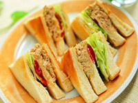
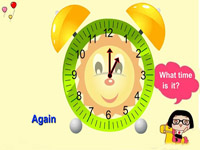
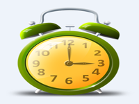
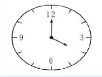
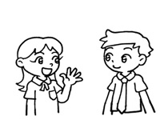

This is unit 10 of  learning Cantonese 1.Listen to this Cantonese  convesation.

李先生，我想和你吃一点东西，好不好啊？
  
几点钟啊？是不是两点钟啊？ 
 
不是，我想晚点吃。    
   
八点钟还是九点钟？
   
九点钟。
 
好。

---

Do you remember how to say"I want to eat somthing"?

我想吃一点东西。
  
Now say"I want to do something.". 
  
我想做一点东西。   

Ask "what do you want to do?".  

你想做什么东西啊？

---
  
Say"I want to buy something." 
  
我想买一点东西。买。   

Ask"at what time?". 
  
几点钟啊？

---

That spoken with  rising high level and mid level tones.Listen and repeat this conversation. 
  
几点钟啊？ 
  
Now say at one o'clock. 
  
一点钟，一，一点钟

---

Now ask"is't nine o'clock?".
  
是不是九点钟啊？

Do you remember how to say"impossible"or"it's impossible"? 
 

---

不可能。
  
Try to say"nine o'clock is impossible". 
 
九点钟不可能。
  
Say"at eight o'clock".

---

八点钟，八，八点钟。
  
Now say"at two o'clock". 
 
两点钟，两。

Do you remember how to say"you can't understand"?  

---

你听不懂。
  
Ask"What can't understand?". 
 
我听不懂什么啊，什么。

---

Ask her"what do you want to drink?".  

你想喝一点东西吗？

Ask her"Do you know?". 
 
你知不知道啊？ 
 
Answer"no,I don't know.". 
 
  

---

不知，我不知道。不知道。  

Now she says"I don't want to drink anything.".Listen and repeat. 
 
我不想喝东西。东西。我不想喝东西。

---

What is the Cantonese word for thing or anything?
  
东西。东西。
  
Say again,"I don't want to drink anything.". 
 
我不想喝东西。
  
How do you ask"do you want to drink somthing"?

---

你想不想喝一点东西啊？一点东西。
  
How does she answer"no,thank you.But I want to eat something."
  
不想，多谢。但是我想吃一点东西。

---

Ask"do you want to drink something"?
  
你想不想喝一点东西啊？
  
Do you remember how to ask"do you want wine or beers"?
  
你想喝酒抑或啤酒啊？

---

Try to ask"if I want to drink something or to eat something"? 
 
喝一点东西，吃一点东西。

---

Say"I don't know." 
 
我不知道。
  
How does she say"I don't want to drink anything"？ 
 
我不想喝东西。东西。

---

Ask her"do you want to eat something with me"?Be careful with the words' order.
  
你想不想和我吃一点东西啊？

---

Say"yes,I want to go to your place to eat.".
  
想，我想和你去。 
 
Ask"when".  

什么时候啊？

---

Ask"at what time"?
  
几点钟啊？ 
 
The question is"what time is it and at what time are they saying in Cantonese".Try to ask"what time is it".

---

几点钟啊？
   
What time is it now?Literally,now what time is it?
  
现在几点钟啊？

---

Say"it's one o'clock".
  
一点钟，一点钟。 
 
Tell me"it's nine o'clock". 
 
九点钟。  

Ask again"what time is it now?". 
 
现在几点钟啊？

---

Answer"it's two o'clock". 
 
两点钟，两点钟。 
 
Here is how to say"it's five o'clock",listen and repeat.
  
五点钟。五。五点钟。

---

The Cantonese number five is pronounced for the slow rising town.Say "five".
  
五，五。  

Tell me"that's five o'clock".  

五点钟。五点钟。

---

Ask"what time is it"? 
 
几点钟啊？ 
 
Listen and repeat the answer. 
 
三点钟。三。三点钟。

---

“三”has a high level town,say"three o'clock'.
  
三点钟。 
 
Now tell me"that's five o'clock". 
 
五点钟，五。

---

Listen and repeat,four o'clock.  

四点钟。四，四，四点钟。

“Four o'clock” is pronounced with rising and high level towns.Tell me "that's four o'clock". 
 

---

四点钟。  

Tell me"that's five o'clock".
  
五点钟。
  
Tell me"that's two o'clock". 
 
两点钟。

---
  
It's four o'clock. 
 
四点钟。四。 
 
Now ask me"if it is nine o'clock",ask"it is,isn't". 
 
是不是九点钟啊？九。

---

Say"now is three o'clock". 
 
不是，现在三点钟。 三点钟。 
 
Tell me"it's eight o'clock".
  
八点钟。

---

Say"four o'clock".

四点钟。 
 
Ask"what time is it". 
 
几点钟啊？

---

Say"it's five o'clock". 
 
五点钟。  

Say"nine o'clock". 
  
九点钟。  

Three o'clock. 
 
三点钟。  

Five o'clock. 
 
五点钟。

---

Now say four o’clock or five o’clock.

四点钟或者五点钟。

或者。

四点钟或者五点钟。

---

Ask me what time is it now.

现在几点钟啊？

Say I don’t know.But I want to eat something.

我不知道，但是我想吃一点东西。

---

Ask me if I want to eat something with you.

你想不想和我吃一点东西啊？一点东西。

How they answer no，thank you.I don’t want to eat anything.

---

不想，多谢。我不想吃东西。东西。

How would you say not now,later OK?

现在不想，迟点好不好哇?

---

I’m going to eat lunch now.Listen and repeat.

我现在会去吃午餐。会。我现在会去吃午餐。

---

Did you hear the man rising tongue the word “going to”. 
Try to say you’re going to eat lunch now.

你现在会去吃午餐。

Try to ask are you going to eat something?

你会不会去吃一点东西啊？

---

不会，会不会，你会不会去吃一点东西啊？

Ask me again if I going to eat something.

你会不会去吃一点东西啊？

---

Answer yes.I’m going to eat lunch now.

会，我现在会去吃午餐。

Try to say I also am going to.

我也去。也，我也去。

---

How they ask if you want to eat something？

你想不想吃一点东西啊？

Tell me you don’t want to eat anything.

我不想吃东西。我不想吃东西。

---

You want to say ask for me.Listen and repeat.

我啊，我啊。

Now try to say ask for me, I’m going to eat lunch now.

我啊，我现在会去吃午餐。

---

Try to say I’m going to eat at five o’clock.Be careful after the words' order.

我会五点钟吃。我会五点钟吃。

---

Try to ask me if I going to eat at five o’clock.

你会不会五点钟吃啊？你会不会五点钟吃啊？

Now answer no, I’m going to eat at eight o’clock.

---

不会，我会八点钟吃。我会八点钟吃。

Say but I’m going to drink something.

但是我会喝一点东西。

Ask when.

---

什么时候啊?什么时候啊?

When do you want to drink something？

你想什么时候喝一点东西啊？

Answer at three o’clock or four o’clock.

---

三点钟或者四点钟。或者。三点钟或者四点钟。

Say ask for me.

我啊，我啊。

---

Ask for me I’m going to drink at nine o’clock.

我啊，我会九点钟喝。

Ask what time is it now.

现在几点钟啊?

---

Say now it is one o’clock.

现在是一点钟，一，是一点钟。

Imaging that you are Mr.Li and you're speaking with Ms.Wang.

王小姐。Ms.Wang.

How would you say good morning to her?

---

王小姐，早上好。

李先生，早上好。你好吗?

很好，多谢。我很好。

Ask her if she wants to drink something.

---

你想不想喝一点东西啊?

How to she answer no,I don’t want to drink anything.

不想，我不想喝东西。

---

Answer her next question more formatively.

请问你想不想和我吃一点东西啊？

想，我想和你吃。我想和你吃。

Ask her when do you want to eat？

你想什么时候吃啊?

---

How to she asks what time is it now?

现在几点钟啊?

Tell her it’s one o’clock.

一点钟，一点钟。

---

she is going to suggest various times to  you.

After each suggestion, tell her that you want to eat an hour later than she does.

你想不想八点钟吃啊？你想不想八点钟吃啊？

不想，我想九点钟吃。我想九点钟吃。

---

九点钟不好，两点钟好不好啊?

不好，两点钟不好，我想三点钟。不好，两点钟不好，我想三点钟。

---

三点钟不好，我想四点钟吃，好不好啊？

不好，我想五点钟吃。

我啊，我不想五点钟吃。

---

Ask her when she wants to eat lunch.

你想什么时候吃午餐啊？

我不知道。

Ask her if she wants to eat lunch.

你想不想吃午餐啊？

---

想，但是什么时候啊？

Tell her you are going to eat lunch now.

我现在会去吃午餐。

Try to ask her if she is going to eat lunch with you.

你会不会和我去吃午餐啊？

---

How to she answer yes,I’m going to eat lunch with you.

会，我会和你去吃午餐。

Ask at what time?

几点钟啊？几点钟啊？

---

Try to ask when do you want to eat lunch with me.Remember the word order.

你想什么时候和我吃午餐啊？你想什么时候和我吃午餐啊？

---

How would you say later OK?

迟点好不好哇?

This is the end of unit ten.
