---

##请听一段电话对话

是不是王小姐啊？
——是，我是

我是李明，你好吗？
——还好，多谢

王小姐，你今晚想不想和我吃晚饭啊？
——今晚不好，明天啦，好不好？

好，几点钟呢？八点钟好不好呢？
——不好

那，七点钟好不好呢？
——好，明天七点钟

拜拜
——拜拜，明天见

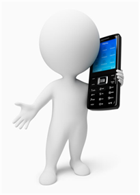

---

##再听一次

是不是王小姐啊？
——是，我是

我是李明，你好吗？
——还好，多谢

王小姐，你今晚想不想和我吃晚饭啊？
——今晚不好，明天啦，好不好？

好，几点钟呢？八点钟好不好呢？
——不好

那，七点钟好不好呢？
——好，明天七点钟

拜拜
——拜拜，明天见

---

迟点呢？

今晚……明天……明天晚上    

六点钟 

迟点吧   

那八点钟啦

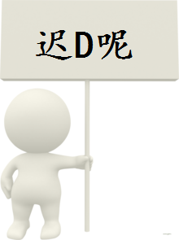

---

现在几点钟呢

现在十点钟

不对，现在四点钟

四

五点钟

---

我会在五点钟吃

你会不会在五点吃呢

你会不会

会，和你一起

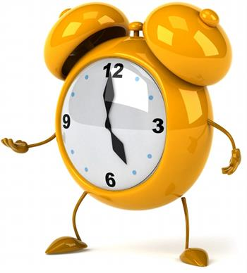

---

今晚我会和你一起吃

我想和你吃晚饭

吃晚饭

都

好，我都想吃

---

那，七点钟啦

你想不想饮酒啊？

不想，我想喝啤酒

今天，我不想喝

---

今晚

你想不想喝点东西呢

今日，我不想饮

我不想饮

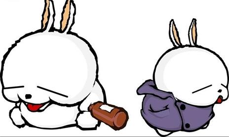

---

今日，我会三点钟吃

今日，我会三点钟吃

或者四点钟吃

四点钟

今日，我不想饮

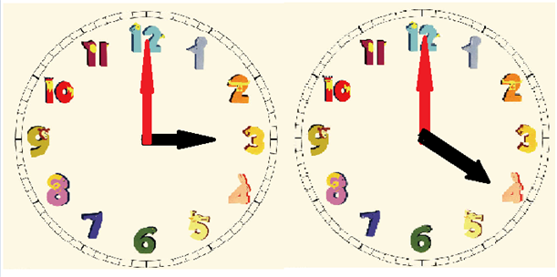

---

明天 明天

明天，我会吃一点晚饭

明晚

我现在想吃晚饭

好

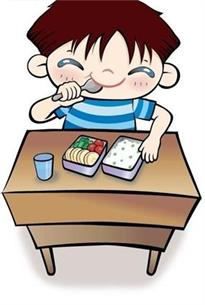

---

几多啊？…… 多

几多啊？…… 几多啊？

几多钱啊？…… 钱……钱……几多钱啊？

钱……钱

多少钱呢

---

港币……币……币

港……港币

港币

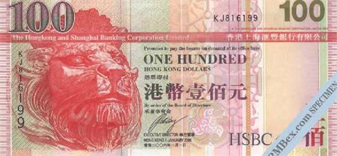

---

几多钱啊？

几多钱啊？

---

一点钟

一点钟

一蚊港币（一块钱港币）

---

一蚊

一蚊港币（一块钱港币）

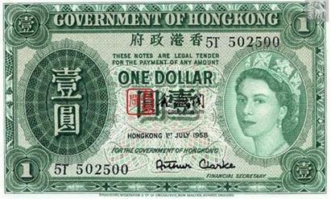

---

几多钱啊？

一蚊港币（一块钱港币）

八蚊港币（八块钱港币

---

##学习数字

十一

一

十

十一

十一

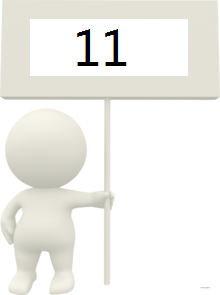

---

几多啊？

几多钱啊？

钱

几多钱啊？

十一块港币

---

十二蚊港币

十二……十二

两杯啤酒 

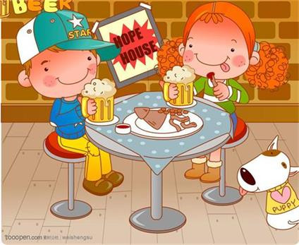

---

十二 ……二……二

十二元港币

二……二

十二……二

十一元港币

十一

---

一元港币……一

二

十二……十二元港币 

---

十三元港币

十三元港币

十三

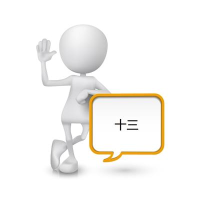

---

几多钱啊？……几多钱啊？

十三元港币 ……十三

十一元港币……十一

---

十元港币……十元港币

二元港币

二

---

十二……二……十二

十元港币

十……十

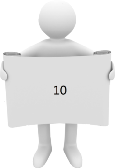

---

八元港币……八

六元港币

几多钱啊？

钱……多少钱啊？

六……六

---

是不是五元港币呢？

不是，是四元港币

是四元港币

---

七蚊港币…… 七

是不是13元港币啊？

13元港币

是不是12元啊？

是不是12元啊？

不是，11元港币

---

你识不识听啊？（你听不听得懂啊？）

听得懂，我现在听得懂

一元港币……一

---

##依家请听，然后回答问题 

---

小姐做甚？你想不想和我吃点饭啊？

不想，多谢

你想不想喝一点酒

不想，我想喝一点啤酒

我想喝一点啤酒

好，什么时候，今天好不好啊

---

不好，明天啦……明天啦

今晚呢

不好，今晚不好，明晚啦

不好，今晚不好，明晚啦

---

几点钟呢？五点钟好不好

五点钟不好，六点钟啦

不好，七点钟啦

七点钟不好，八点钟啦

七点钟不好，八点钟啦

好，明晚八点钟，拜拜

---

几多钱啊 ……多少钱啊

十三元港币

不是，是十二元港币

不是，是十一元，是十一元港币

---

不是十一元，是十元

不是十一元，是十元

十元不行，八元港币好不好啊

不好，是七元港币

好，是七元港币啦

