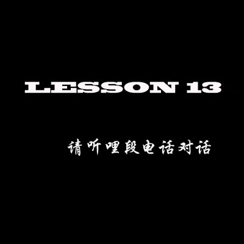

---

###情景对话
男：黄小姐，早安       女：李先生,早安。你好吗？

男：很好，多谢。黄小姐，你今晚做什么啊？   女：今晚？我不知道。

男：我六点钟和你一起吃晚饭，好不好？    女：不好。我今晚会同刘小姐吃晚饭

男： 你想不想迟点喝一些东西啊      女：想，但是我想去我那里喝，好不好啊

男：好，几点钟啊？   女：九点钟或者迟点，十点钟，好不好

男：好。十点钟去你那里。拜拜

---

You just heard the womam say:

我今晚会同刘小姐吃晚饭

or I am going to eat dinner with Mrs.liu tonight.

再听一次

---

###再听一遍情景对话
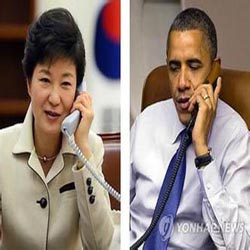

---

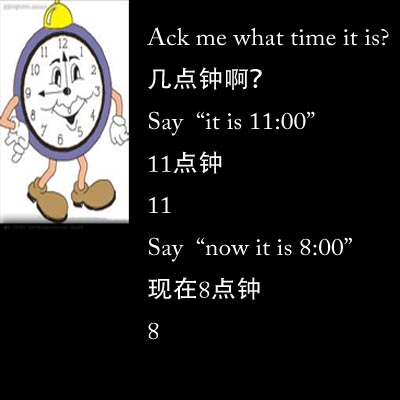

---

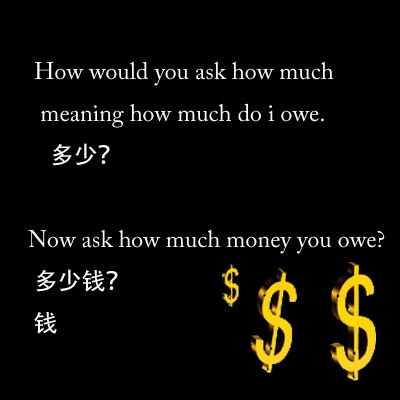

---

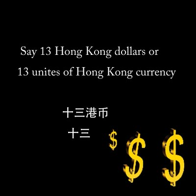

---

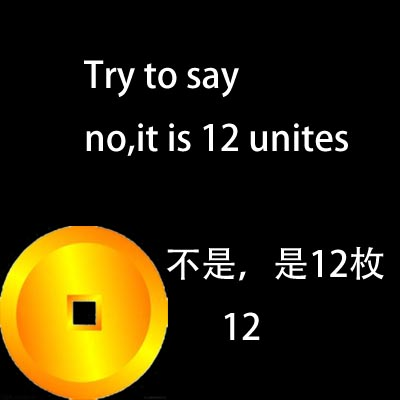

---

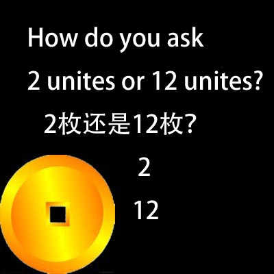

---

Say i can not understand

我唔识听

---

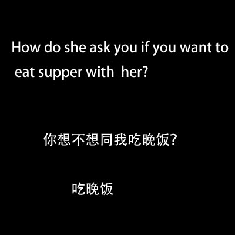

---

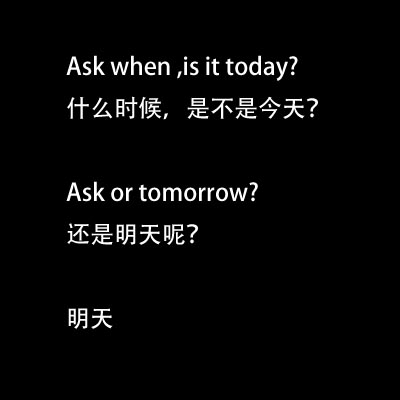

---

Say this evening
今晚

Say tomorrow evening
明晚

Ask at what time?
几点钟啊？

---

Say 6:00 or 7:00
六点钟还是七点钟？

Ask is it today?
是不是今天啊？

---

###复习巩固并参与
Do you remember how to say impossible?
不可能

Say i don't want to eat supper with you.
我不想同你吃晚饭

---

Do you remember how to say hello in Cantonese?
你好

And how would you ask the womam how she is ?
你好吗？

very well, thanks.
很好，多谢

---

Do you remember how to ask some one how much you owe?
多少钱？

You want to ask how many Hong Kong dollars do you have?
几多港币？

Please repeat 再读一遍

几多港币？
你有几多港币啊？

有
有

---

The word 'have' is pronounced to the low rising tongue.Say again you have.

你有

Listen and repeat  how many Hong Kong dollars?
几多港币啊？

几多

几多港币啊？

---

You only use the word 'unites' with specific numbers, not to ask how much or how many.

Now ask how many Hong Kong dollars do you have?

你有几多港币啊？

---

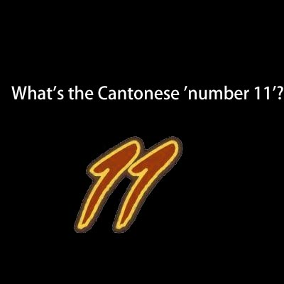

---

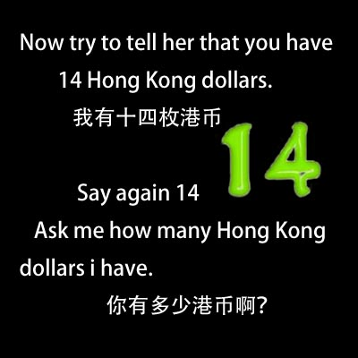

---

Now you want to ask how many American dollars do you have

请跟着讲：你有多少美金啊？ 

美金
美金

你有多少美金啊？ 

---

---

Say i have 14 American dollars or 14 unites US currency.

我有14枚美金

14

---

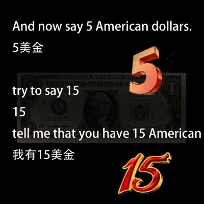

---

Ask how mang  Hong Kong dollars i have.

你有多少港币啊？

Say i have 15 Hong Kong dollars.

我有15港币。

15

---

Now say i have 14 American dollars.

我有14枚美金

tell me that you have 14 American dollars

我有14枚美金

---

Here is how to ask 'Do you have?'

请跟着讲：你有没啊？

没

没

你有没啊

---

How do you say don't have

没  没

'NO' is a low rising tongue.  Ask 'do you have?'

你有没啊？

Do you remember how to ask are you?

你是不是啊?

是  不是

---

Ask again 'do you have?'

你有没啊？

有 没

Do you have 7 Hong Kong dollars?

请跟着讲：你有没有7枚港币

Now ask me if i have 6 Hong Kong dollars?

你有没有6枚港币?

6

---

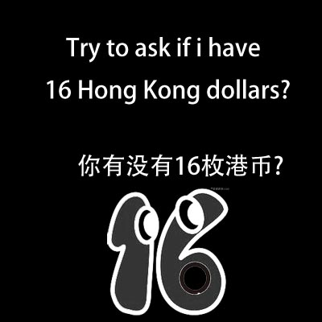

---

Now try to answer 'No, i have 13 Hong Kong dollars'.
不，我有13枚港币     

13

How would you tell her,I have three American dollars.
我有三美金。

Now say,I have fifteen American dollars.
我有十五美金。

---

Ask me if I have sixteen American dollars.
你有十六美金吗？

How would you answer this question,no.
没，没  

No,I don’t have sixteen American dollars.
没，我没有十六美金。  

---

Ask the sales women,how much money it is.多少钱啊？

She says fifteen Hong Kong dollars.十五港币。

十五

---

Try to ask,what about American dollars?美金呢？

呢，

美金呢？

---

Say fourteen Hong Kong dollars.十四港币。  

Say I have ten American dollars.我有十美金。  

Ask do you have five American dollars.你有五美金吗？

五美金

---

Ask how much money you owe.多少钱啊？  

Say fifteen Hong Kong dollars.十五港币。   

Ask again,what about American dollars?美金呢？

美金呢？

---

Say five American dollars.五美金。  

Say,I don’t have sixteen Hong Kong dollars.我没有十六港币。  

Say,I have fourteen Hong Kong dollars.我没有十四港币。

---

Say,I don’t have fifteen units.我没有十五枚。  

Try to tell him,in that case,let’s say fourteen Hong Kong dollars.        

咁，十四港币啦。咁-啦，咁，十四元港币啦。

---

Say,thank you,good bye.

多谢，再见。

多谢，再见。

---

Now let’s have a discussion with the sales women again.Ask her how much money you owe.  

多少钱啊？

多少钱啊？

---

How did she tell you eleven Hong Kong dollars.十一元港币。  

Here is the Cantonese word for plus.
请跟我讲，加，加，加  

Did you hear the high level tone,try to say,eleven plus one.十一加一，加

---

Now the sales women is going to add one or two Hong Kong dollars at a time to the price.  
Every time she say the number,you add it on add say the total.

十一元港币加一元

十二元，十二元港币。

---

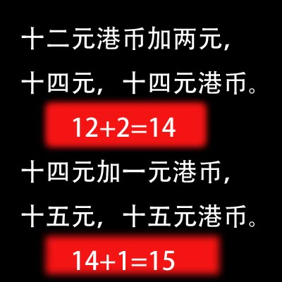

---

###15+1=16
十五元港币加一元，十六元，十六元港币。

十六元港币，你有没有十六元港币啊？

Tell her you don’t have any Hong Kong dollars.

我没有港币.我没有港币。

---

Ask what about American dollars?How much money is it?

美金呢？多少钱啊？

美金呢？

你有多少美金啊？

---

Tell her you have fifteen American dollars.我有十五元美金。  

How did she say,in that case,let’s say ten American dollars.咁，十元美金啦。  

You answer here you are,ten American dollars.Listen and repeat.呐，十元美金，呐

---

The Cantonese word that means here or here you are is pronounced to the mid-falling tone.  
Say,here you are,ten American dollars.
呐，十元美金。
呐

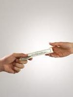

---

##情景想象&练习
Now image you in the cafe in Hong Kong.You are going to talk to the man behind the counter.
Respond to what he says to you.

你好

你好

---

###How did she ask if you want to eat something.
你想不想吃一点啊？

---

Try to ask if you want to eat something this evening?

你想不想今晚吃一点啊？

你想不想今晚吃一点啊？

---

Yes,I want to eat supper.想，我想吃晚饭。我想吃晚饭。

你想吃什么啊？  

Tell him that you want one beer or one cup of beer.
我要一杯啤酒。

你要一杯还是两杯啊？

---

Tell him you can’t understand.
我唔识听

你要一杯啤酒还是两杯啊？

一杯，我要一杯啤酒。

How did she say,OK,here you are,one beer.好，呐，一杯啤酒。

---

Ask him how much money it is?多少钱啊？

十一元港币。  

Tell him you don’t have any Hong Kong dollars.我没有港币。

---

Ask him what about American dollars?How much money is it?美金呢？多少钱啊？

美金呢？多少钱啊？

美金？我不知道。

---

Tell him as for me，I know.我啊，我知道。

我啊，我知道。  

Tell him you have fifteen American dollars.我有十五元美金

---

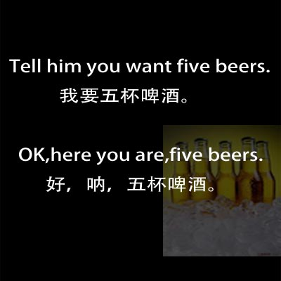

---

##This is the end of unit thirteen.

 

