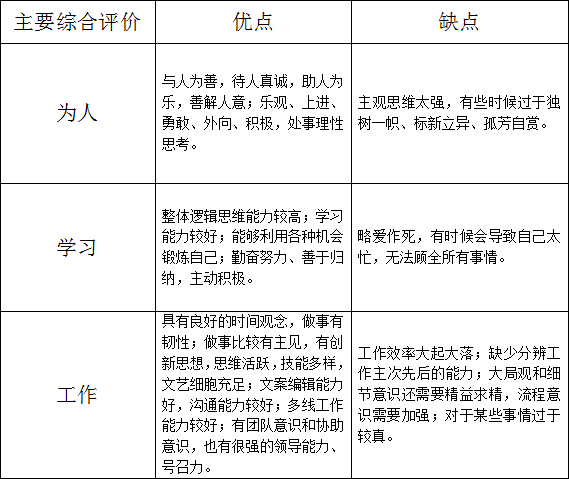
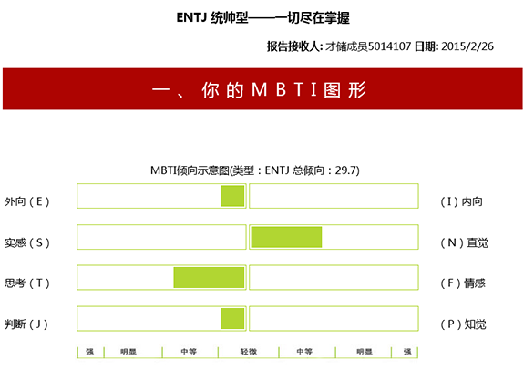
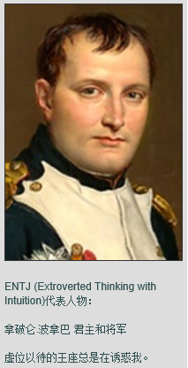
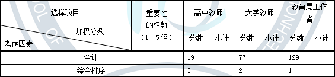
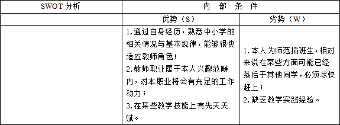
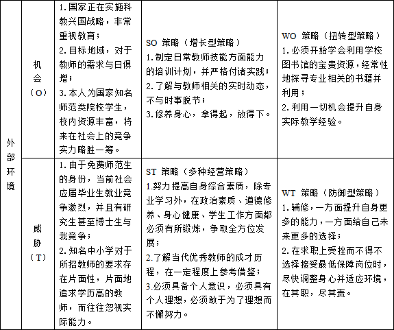

##这是柯俊豪小同学的
###『职业生涯规划』

---

##先说句话：

你今天站在哪里并不重要，  
重要的是你下一步将迈向哪里。

####摘自规划书模板页眉处

---

##一、360°主要综合评价

###以上评价来自“个人、家长、老师、朋友”。

---

##二、我的MBTI职业兴趣测试

###统帅型？好像很厉害的样子……

--

##统帅型——一切尽在掌握
  
ENTJ型的人是热心而真诚的领导者和决策人

--

##适合的领域与职业

####领域
* 政界
* 培训
* 专业性领域
####职业
* 政治家
* 总经理
* 大学教师

---

##三、职业认知

###请无视貌似与事实不太相符的长发

--

##职业选择
  
相差悬殊！  
不是一般的悬殊！  
但似乎蛮符合我的个人志向。

---

##四、十分专业全面的SWOT分析

###↑SWOT内部条件分析↑

--

###↑SWOT外部环境分析↑

---

##五、职业目标与路径

####近期职业目标
* 恶补教师技能方面的知识与能力，制定日常计划
* 专心做好项目与比赛准备
* 完成好最后一学期的团学工作

--

####中期职业目标
* 拿下一切必须以及个人兴趣范畴的证件与认证资格
* 全面发展自身个发那个面能力，成为自己理想中的样子
* 积极提升自身修养和思想觉悟，争取在校期间成为正式共产党员

--

####长期职业目标
* 争取通过自己理想中的就职学校的面试
* 在职期间，成为学校中知名的教师
* 在其职，尽其责，提升自我

---

##六、制定行动计划
* 在校期间合理利用学校资源，要在毕业时成功蜕变
* “不要脸”地争取自己理想的就职学校的认可
* 尽自己所能，做最好的教育者
* 活到老学到老，步步攀升

---

##七、职业宣言

####四个永远
* 永远记得：恐怖的不是有人比我强，而是那些比我强的人比我更加勤奋和用功。
* 永远知道：天有多高，地有多厚，山外还有多少山，人外还有多少人，然后放低姿态地去努力。
* 永远明确：自己的初衷和自己的目标，不动摇，否则一切都是白费。
* 永远记得：我自己一直以来所向往和崇拜的人是什么样的，以及记得我是何等地想要变得像他们一样，又不一样。

---

##最后说几句
* 学高为师，身正为范。
* 在其职，尽其责。
* Always remember, A Phoenix Inside of Me.