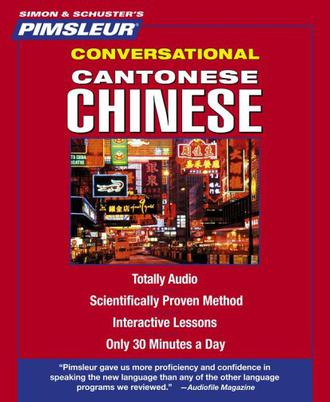
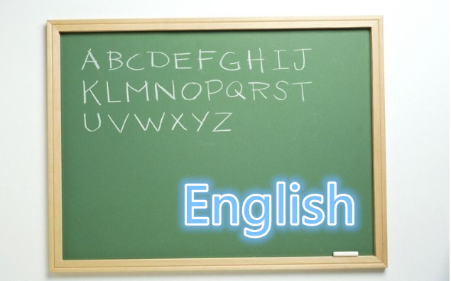
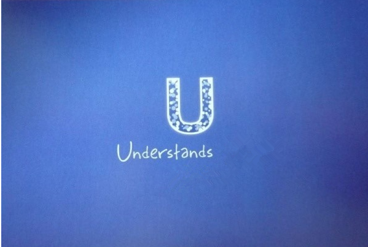
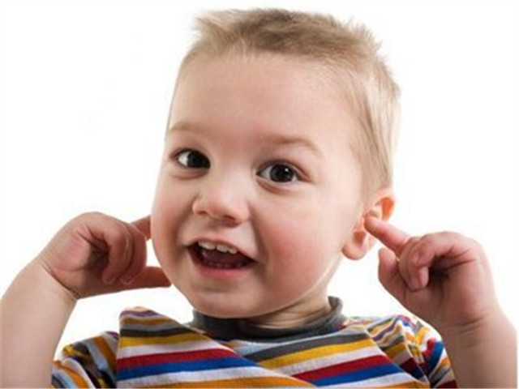


####本堂课主要内容
* 简单的粤语开场白

【Made by 柯俊豪、梁洪玉、吴倩、刘艺茹、乔婧怡、苏嫣、段若宜】

---

  
【导引】  
This is Unit 1 of Pimsleurs Cantonese One.  
Listen to this conversation.

---

【粤语】  
“请问小姐，你识唔识听英文啊？”

---

【粤语】  
“唔识听，我唔识听英文。”

---

【粤语】  
“我识听一滴广东话。”

---

【粤语】  
“你是唔是美国人啊？”

---

【粤语】  
“是，我是美国人。”

---

【导引】  
In the next few minutes, you will learn not only to understand this conservation, but to take part in it yourself.

---

【导引】  
Imagine that an American man, meeting a Cantonese woman.  
 He wants to begin a convervation, so he says..."Excuse me".

---

【粤语】  
“请问……”

---

【导引】  
The Cantonese speaker going to repeat this word, part by part, starting from the end.   
You are to repeat each part after him.   
Trying to make your pronunciation sound exactly like his. Be sure to repeat aloud.

---

【粤语】  
“问……问……”

---

【粤语】  
“请……请……”

---

【粤语】  
“请问”

---

【导引】  
How do you say "excuse me" in Cantonese?

---

【粤语】  
“请问”

---

【导引】  
Now he wants to ask her, if she can understand English.  
Here's the name of English Language in Cantonese.  
Listen and repeat.

---

【粤语】  
“英文”

---

【粤语】  
“文……文……”

---

【粤语】  
“英……英……”

---

【粤语】  
“英文”

---

【导引】  
How do you say "English"?

---

【粤语】  
“英文……英文……”

---

【导引】  
Now say "Excuse me".

---

【粤语】  
“请问”

---

  
【导引】  
You should repeat the correct response after the speaker,
try to make your pronounciation like his.

---

【粤语】  
“请问”

---

  
【导引】  
Say again "English".

---

【粤语】  
“英文”

---

  
【导引】  
Now he wants to ask "Can you understand?", first the word "can", listen and repeat.

---

【粤语】  
“识……识……”

---

  
【导引】  
To ask someone if he can understand in Cantonese,
you ask literily: "Can you hear?".  
Here's the word "hear", listen and repeat.

---

【粤语】  
“听……听……识听……”

---

  
【导引】  
Say "can hear" or "can understand".

---

【粤语】  
“识听”

---

  
【导引】  
Here's how to say "you can understand".  
Listen and repeat.

---

【粤语】  
“你识听”

---

【粤语】  
“你……你……”

---

【粤语】  
“你识听”

---

  
【导引】  
What part of that means "you"?

---

【粤语】  
“你……你……”

---

  
【导引】  
Say again "you can understand".

---

【粤语】  
“你识听……你识听……”

---

  
【导引】  
Do you remember how to say “English”？

---

【粤语】  
“英文”

---

【导引】        
You've probably noticed that some words seem to end abruptly, and that some are pronounced to the higher pitch than others.  
In Cantonese the different tones indicate different meanings, you should imitate the speakers, and try to make your pronunciation sound like theirs.   
Paying careful attention to the "Intonation"

---

【导引】        
Say, "you can understand".

---

【粤语】  
“你识听”

---

【导引】        
Now try to say, "you can understand English". 

---

【粤语】  
“你识听英文”

---

【导引】  
Now here's how to say, "can't understand".  
Listen and repeat.

---

【粤语】  
“唔识听”

---

【粤语】  
“唔……唔识……唔识听……”

---

【导引】  
Did you hear how the tone fell and then rolls at the beginning of that?  
Say again, "can't understand".

---

【粤语】  
“唔识听……唔识听……唔……”  

---

【导引】  
With the falling tone is what makes that nagative.  
Now say together, "can understand", "can't understand".  
   

---

【粤语】  
“识听……唔识听……识……唔识……”

---

【导引】  
Many Cantonese words can be made nagative by begining them with the sound.   
Now try to say, "you can't understand"  

---

# Pimsluer Cantonese One

## Unit1 Lesson one
【粤语】  
“你唔识听”  

---

【导引】  
Here's how to ask, "can you understand?".  
Just listen.

---

【粤语】  
“你识唔识听啊？……你识唔识听啊？”  

---

【导引】  
Literally you ask, "you can can't you understand?".  
Listen and repeat, "can you understand?".

---

【粤语】  
“你识唔识听啊？”

---

【粤语】  
“啊……啊……”  

---

【粤语】  
“识唔识”

---

【粤语】  
“你识唔识听啊？”

---

【导引】  
The "啊" sounded in the end is used to make the question more polite.  
Ask me if I can understand.

---

【粤语】  
“你识唔识听啊？”

---

【导引】  
What part of that means "can't understand"?

---

【粤语】  
“唔识听”

