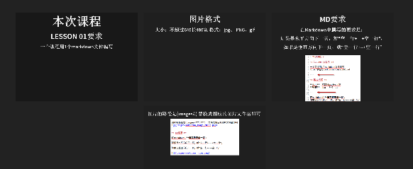

# 本次课程 #

## lesson 01要求 ##

一个课程用1个markdown文件编写
Note:命名为cantonses-lesson01.md

---

## 图片格式 ##

**大小**：不超过640长480宽 
**格式**：jpg、 PNG、gif

--

图片的路径是(images/***.***)  替换成相应的图片文件名即可

---

## MD要求 ##

在Markdown中**撰写的要求**是：

如果是水平方向下一页，就“空一行+---+空一行”，
 
如果是垂直方向下一页，就“空一行+--+空一行”

---

## 声音命名规则 ##

这张图片上从左到右，从上到下，分别是

|0.0.mp3  | 1.0.mp3 | 2.0.mp3|
|---|--|--|
|  |1.1.mp3|  |
声音格式暂时不考虑ogg，统一用mp3